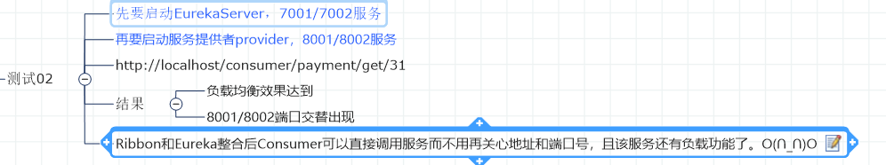
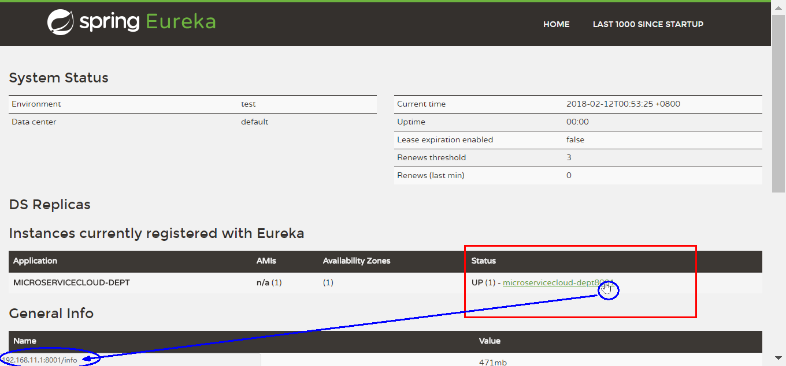
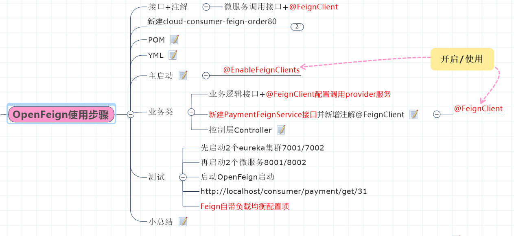
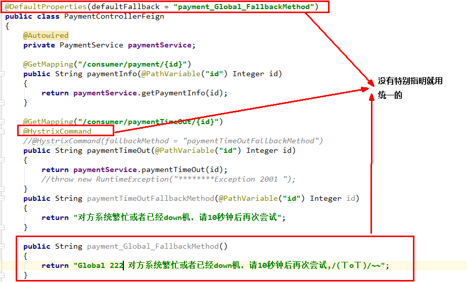
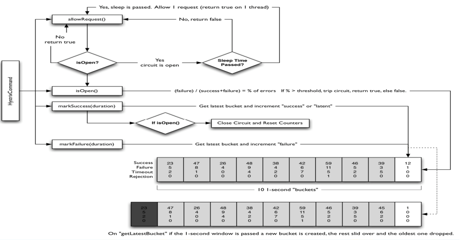
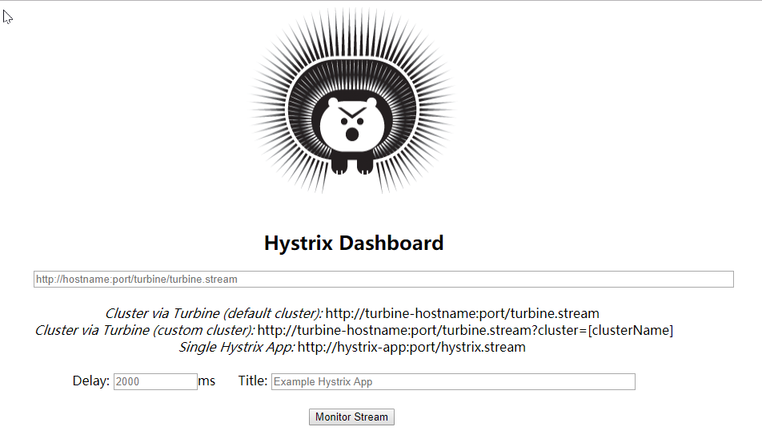
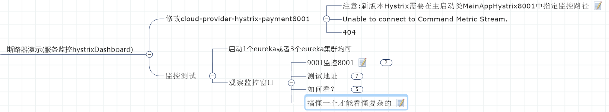

# SpringCloud

SpringCloud2020年的技术变更

## 关于Cloud各种组件的停更/升级/替换

SpringCloudNetflix组件大部分进入维护状态，从而Spring官方推荐进行一些相应组件的升级与替换

维护前的主要cloud组件


推荐替换的相应组件


## 微服务架构编码构建

### 未引入服务注册与发现组件实现服务调用(RestTemplate)


> 此时，项目未引入SpringCloud的服务注册与发现组件，服务之间的调用使用restTemplate进行相互调用

（1）项目架构

```txt
cloud2020
    cloud-api-commons  服务提供与消费共同使用的相关类
    cloud-consumer-oreder80    服务消费80
    cloud-provider-payment8001 服务提供8001
```


（2）核心代码

cloud-provider-payment8001

```java
package com.adun.springcloud.service.impl;

@Service
public class PaymentServiceImpl implements PaymentService {

    @Resource
    private PaymentDao paymentDao;

    @Override
    public int create(Payment payment) {
        return paymentDao.create(payment);
    }

    @Override
    public Payment getPaymentById(Long id) {
        return paymentDao.getPaymentById(id);
    }
}
```

cloud-consumer-oreder80

```java
package com.adun.springcloud.controller;

@RestController
@Slf4j
public class OrderController {

    public static final String PAYMENT_URL="http://localhost:8001";
    //引入服务注册中心后可以使用注释替换上方代码
    //public static final String PAYMENT_URL="http://CLOUD-PAYMENT-SERVICE";

    @Resource
    private RestTemplate restTemplate;

    @Resource
    private DiscoveryClient discoveryClient;

    @Resource
    private LoadBalancer loadBalancer;

    @GetMapping(value = "/consumer/payment/create")
    public CommonResult<Payment> create(Payment payment){
        log.info("消费端create：{}",payment);
        return restTemplate.postForObject(PAYMENT_URL + "/payment/create", payment, CommonResult.class);
    }

    @GetMapping(value = "/consumer/payment/get/{id}")
    public CommonResult<Payment> getPaymentById(@PathVariable("id") Long id){
        log.info("消费端getPaymentById：{}",id);
        Map<String, Object> map = new HashMap<>();
        map.put("id", id);
        return restTemplate.getForObject(PAYMENT_URL + "/payment/get/{id}", CommonResult.class,map);
    }
}
```

## 微服务注册中心

1. 什么是服务治理　
   
   ​        Spring Cloud 封装了 Netflix 公司开发的 Eureka 模块来实现服务治理
   
   ​       在传统的rpc远程调用框架中，管理每个服务与服务之间依赖关系比较复杂，管理比较复杂，所以需要使用服务治理，<mark>管理服务于服务之间依赖关系</mark>，可以实现服务调用、负载均衡、容错等，实现服务发现与注册。

2. 什么是服务注册与发现
   
           Eureka采用了CS的设计架构，Eureka Server 作为服务注册功能的服务器，它是服务注册中心。而系统中的其他微服务，使用 Eureka的客户端连接到 Eureka Server并维持心跳连接。这样系统的维护人员就可以通过 Eureka Server 来监控系统中各个微服务是否正常运行。
   
   ​        在服务注册与发现中，有一个注册中心。当服务器启动的时候，会把当前自己服务器的信息 比如 服务地址通讯地址等以别名方式注册到注册中心上。另一方（消费者|服务提供者），以该别名的方式去注册中心上获取到实际的服务通讯地址，然后再实现本地RPC调用RPC远程调用框架核心设计思想：在于注册中心，因为使用注册中心管理每个服务与服务之间的一个依赖关系(服务治理概念)。在任何rpc远程框架中，都会有一个注册中心(存放服务地址相关信息(接口地址))
   
   ​    下左图是Eureka系统架构，右图是Dubbo的架构，请对比
   
   

### Eureka项目相关


Eureka包含两个组件：<mark>Eureka Server</mark>和<mark>Eureka Client</mark>

<mark>Eureka Server提供服务注册服务</mark>
各个微服务节点通过配置启动后，会在EurekaServer中进行注册，这样EurekaServer中的服务注册表中将会存储所有可用服务节点的信息，服务节点的信息可以在界面中直观看到。

<mark>EurekaClient通过注册中心进行访问</mark>
是一个Java客户端，用于简化Eureka Server的交互，客户端同时也具备一个内置的、使用轮询(round-robin)负载算法的负载均衡器。在应用启动后，将会向Eureka Server发送心跳(默认周期为30秒)。如果Eureka Server在多个心跳周期内没有接收到某个节点的心跳，EurekaServer将会从服务注册表中把这个服务节点移除（默认90秒）

#### 单机Eureka构建步骤

> 此时，项目未引入SpringCloud的服务注册与发现组件，服务之间的调用使用restTemplate进行相互调用

##### 1、项目架构

```
cloud2020
    cloud-api-commons  服务提供与消费共同使用的相关类
    cloud-eureka-server7001    服务注册中心7001
    cloud-consumer-oreder80    服务消费80
    cloud-provider-payment8001 服务提供8001
```

##### 2、构建cloud-eureka-server7001

pom引入

```xml
<!--eureka-server-->
<dependency>
    <groupId>org.springframework.cloud</groupId>
    <artifactId>spring-cloud-starter-netflix-eureka-server</artifactId>
</dependency>
```

yml修改

```yaml
server:
  port: 7001

eureka:
  instance:
    hostname: localhost #eureka服务端的实例名称
  client:
    #false表示不向注册中心注册自己。
    register-with-eureka: false
    #false表示自己端就是注册中心，我的职责就是维护服务实例，并不需要去检索服务
    fetch-registry: false
    service-url:
    #设置与Eureka Server交互的地址查询服务和注册服务都需要依赖这个地址。
      defaultZone: http://${eureka.instance.hostname}:${server.port}/eureka/
```

主启动类添加注解`@EnableEurekaServer`

```java
@SpringBootApplication
@EnableEurekaServer
public class EurekaMain7001
{
    public static void main(String[] args)
    {
        SpringApplication.run(EurekaMain7001.class,args);
    }
}
```

测试

http://localhost:7001/


##### 3、EurekaClient端cloud-provider-payment8001

将注册进EurekaServer成为服务提供者provider

改POM

```xml
 <!--eureka-client-->
<dependency>
    <groupId>org.springframework.cloud</groupId>
    <artifactId>spring-cloud-starter-netflix-eureka-client</artifactId>
</dependency>
```

修改yml

```yaml
server:
  port: 8001

spring:
  application:
    name: cloud-payment-service
  datasource:
    type: com.alibaba.druid.pool.DruidDataSource            # 当前数据源操作类型
    driver-class-name: org.gjt.mm.mysql.Driver              # mysql驱动包
    url: jdbc:mysql://localhost:3306/db2019?useUnicode=true&characterEncoding=utf-8&useSSL=false
    username: root
    password: 123456

##eureka-client注册自己到eureka-server
eureka:
  client:
    #表示是否将自己注册进EurekaServer默认为true。
    register-with-eureka: true
    #是否从EurekaServer抓取已有的注册信息，默认为true。单节点无所谓，集群必须设置为true才能配合ribbon使用负载均衡
    fetchRegistry: true
    service-url:
      defaultZone: http://localhost:7001/eureka
```

修改主启动类添加注解`@EnableEurekaClient`

```java
@SpringBootApplication
@EnableEurekaClient
public class PaymentMain8001
{
    public static void main(String[] args)
    {
        SpringApplication.run(PaymentMain8001.class,args);
    }
}
```

##### 4、EurekaClient端cloud-consumer-order80

将注册进EurekaServer成为服务消费者consumer

改POM

```xml
 <!--eureka-client-->
<dependency>
    <groupId>org.springframework.cloud</groupId>
    <artifactId>spring-cloud-starter-netflix-eureka-client</artifactId>
</dependency>
```

修改yml

```yaml
server:
  port: 80

spring:
    application:
        name: cloud-order-service

eureka:
  client:
    #表示是否将自己注册进EurekaServer默认为true。
    register-with-eureka: true
    #是否从EurekaServer抓取已有的注册信息，默认为true。单节点无所谓，集群必须设置为true才能配合ribbon使用负载均衡
    fetchRegistry: true
    service-url:
      defaultZone: http://localhost:7001/eurek
```

修改主启动类添加注解`@EnableEurekaClient`

```java
@SpringBootApplication
@EnableEurekaClient
public class OrderMain80
{
    public static void main(String[] args)
    {
        SpringApplication.run(PaymentMain8001.class,args);
    }
}
```

##### 5、测试


#### 集群Eureka构建步骤

##### 1、基本项目架构

```
cloud2020
    cloud-api-commons  服务提供与消费共同使用的相关类
    cloud-eureka-server7001    服务注册中心7001
    cloud-eureka-server7002       服务注册中线7002
    cloud-consumer-oreder80    服务消费80
    cloud-provider-payment8001 服务提供8001
    cloud-provider-payment8002 服务提供8002
```


##### 2、eureka server集群基本原理与实现


- [ ] 问题：微服务RPC远程服务调用最核心的是什么 ?
  
         高可用，试想你的注册中心只有一个only one， 它出故障了那就呵呵(￣▽￣)"了，会导致整个为服务环境不可用，所以
  
  <mark>解决办法：搭建Eureka注册中心集群 ，实现负载均衡+故障容错</mark>


##### 3、EurekaServer集群环境构建步骤

cloud-eureka-server7001

cloud-eureka-server7002

改POM

```xml
<!--eureka-server-->
<dependency>
    <groupId>org.springframework.cloud</groupId>
    <artifactId>spring-cloud-starter-netflix-eureka-server</artifactId>
</dependency>
```

写yml【7001与7002相互注册】

7001

```yaml
server:
  port: 7001


eureka:
  instance:
    hostname: eureka7001.com #eureka服务端的实例名称
  client:
    register-with-eureka: false     #false表示不向注册中心注册自己。
    fetch-registry: false     #false表示自己端就是注册中心，我的职责就是维护服务实例，并不需要去检索服务
    service-url:
      defaultZone: http://eureka7002.com:7002/eureka/
```

7002

```yaml
server:
  port: 7002


eureka:
  instance:
    hostname: eureka7002.com #eureka服务端的实例名称
  client:
    register-with-eureka: false     #false表示不向注册中心注册自己。
    fetch-registry: false     #false表示自己端就是注册中心，我的职责就是维护服务实例，并不需要去检索服务
    service-url:
      defaultZone: http://eureka7001.com:7001/eureka/
```

主启动

```java
@SpringBootApplication
@EnableEurekaServer
public class EurekaMain7002
{
    public static void main(String[] args)
    {
        SpringApplication.run(EurekaMain7002.class,args);
    }
}
```

##### 4、将支付服务8001微服务发布到上面2台Eureka集群配置中

改yml

```yaml
server:
  port: 8001

spring:
  application:
    name: cloud-payment-service
  datasource:
    type: com.alibaba.druid.pool.DruidDataSource            # 当前数据源操作类型
    driver-class-name: org.gjt.mm.mysql.Driver              # mysql驱动包
    url: jdbc:mysql://localhost:3306/db2019?useUnicode=true&characterEncoding=utf-8&useSSL=false
    username: root
    password: 123456


eureka:
  client:
    #表示是否将自己注册进EurekaServer默认为true。
    register-with-eureka: true
    #是否从EurekaServer抓取已有的注册信息，默认为true。单节点无所谓，集群必须设置为true才能配合ribbon使用负载均衡
    fetchRegistry: true
    service-url:
      #defaultZone: http://localhost:7001/eureka
      defaultZone: http://eureka7001.com:7001/eureka,http://eureka7002.com:7002/eureka  # 集群版

mybatis:
  mapperLocations: classpath:mapper/*.xml
  type-aliases-package: com.atguigu.springcloud.entities    # 所有Entity别名类所在包
```

##### 5、将订单服务80微服务发布到上面2台Eureka集群配置中

改yml

```yaml
server:
  port: 80

spring:
    application:
        name: cloud-order-service

eureka:
  client:
    #表示是否将自己注册进EurekaServer默认为true。
    register-with-eureka: true
    #是否从EurekaServer抓取已有的注册信息，默认为true。单节点无所谓，集群必须设置为true才能配合ribbon使用负载均衡
    fetchRegistry: true
    service-url:
      #defaultZone: http://localhost:7001/eureka
      defaultZone: http://eureka7001.com:7001/eureka,http://eureka7002.com:7002/eureka  # 集群版
```

##### 6、测试01


##### 7、负载均衡环境搭建测试

###### （1）支付服务提供者8001/8002集群环境构建

修改yml【注册中心为集群需要特别配置】

> 是否从EurekaServer抓取已有的注册信息，默认为true。单节点无所谓，集群必须设置为true才能配合ribbon使用负载均衡
>     fetchRegistry: true

```yaml
server:
  port: 8002

spring:
  application:
    name: cloud-payment-service
  datasource:
    type: com.alibaba.druid.pool.DruidDataSource            # 当前数据源操作类型
    driver-class-name: org.gjt.mm.mysql.Driver              # mysql驱动包
    url: jdbc:mysql://localhost:3306/db2019?useUnicode=true&characterEncoding=utf-8&useSSL=false
    username: root
    password: 123456

eureka:
  client:
    #表示是否将自己注册进EurekaServer默认为true。
    register-with-eureka: true
    #是否从EurekaServer抓取已有的注册信息，默认为true。单节点无所谓，集群必须设置为true才能配合ribbon使用负载均衡
    fetchRegistry: true
    service-url:
      defaultZone: http://eureka7001.com:7001/eureka,http://eureka7002.com:7002/eureka  # 集群版
      #defaultZone: http://localhost:7001/eureka  # 单机版


mybatis:
  mapperLocations: classpath:mapper/*.xml
  type-aliases-package: com.atguigu.springcloud.entities    # 所有Entity别名类所在包
```

修改8001/8002的Controller,返回当前服务的端口名

```java
@RestController
@Slf4j
public class PaymentController
{
    @Value("${server.port}")
    private String serverPort;

    @Resource
    private PaymentService paymentService;

    @PostMapping(value = "/payment/create")
    public CommonResult create(@RequestBody Payment payment)
    {
        int result = paymentService.create(payment);
        log.info("*****插入操作返回结果:" + result);

        if(result > 0)
        {
            return new CommonResult(200,"插入成功,返回结果"+result+"\t 服务端口："+serverPort,payment);
        }else{
            return new CommonResult(444,"插入失败",null);
        }
    }

    @GetMapping(value = "/payment/get/{id}")
    public CommonResult<Payment> getPaymentById(@PathVariable("id") Long id)
    {
        Payment payment = paymentService.getPaymentById(id);
        log.info("*****查询结果:{}",payment);
        if (payment != null) {
            return new CommonResult(200,"查询成功"+"\t 服务端口："+serverPort,payment);
        }else{
            return new CommonResult(444,"没有对应记录,查询ID: "+id,null);
        }
    }
}
```

###### （2）订单服务访问地址不能写死

```java
//public static final String PAYMENT_SRV = "http://localhost:8001";

// 通过在eureka上注册过的微服务名称调用
public static final String PAYMENT_SRV = "http://CLOUD-PAYMENT-SERVICE";
```

###### （3）使用@LoadBalanced注解赋予RestTemplate负载均衡的能力

> 提前说一下Ribbon的负载均衡功能: LoadBalanced底层与ribbon相似，使用方式一致

```java
@Configuration
public class ApplicationContextBean
{
    @Bean
    @LoadBalanced //使用@LoadBalanced注解赋予RestTemplate负载均衡的能力
    public RestTemplate getRestTemplate()
    {
        return new RestTemplate();
    }
}
```

###### （4）测试02



#### actuator微服务信息完善

###### （1）主机名称:服务名称修改

问题

没有主机名


修改yml

```yaml
eureka:
  client:
    #表示是否将自己注册进EurekaServer默认为true。
    register-with-eureka: true
    #是否从EurekaServer抓取已有的注册信息，默认为true。单节点无所谓，集群必须设置为true才能配合ribbon使用负载均衡
    fetchRegistry: true
    service-url:
      defaultZone: http://eureka7001.com:7001/eureka,http://eureka7002.com:7002/eureka  # 集群版
      #defaultZone: http://localhost:7001/eureka  # 单机版
  #    
  instance:
    instance-id: payment8001
```


###### （2）访问信息有IP信息提示

问题

没有IP提示

修改yml

```yaml
eureka:
  client:
    #表示是否将自己注册进EurekaServer默认为true。
    register-with-eureka: true
    #是否从EurekaServer抓取已有的注册信息，默认为true。单节点无所谓，集群必须设置为true才能配合ribbon使用负载均衡
    fetchRegistry: true
    service-url:
      defaultZone: http://eureka7001.com:7001/eureka,http://eureka7002.com:7002/eureka  # 集群版
      #defaultZone: http://localhost:7001/eureka  # 单机版
  instance:
    instance-id: payment8001
    prefer-ip-address: true     #访问路径可以显示IP地址
```



#### 服务发现Discovery

> 对于注册进eureka里面的微服务，可以通过服务发现来获得该服务的信息

##### (1)修改cloud-provider-payment8001的Controller

```java
package com.atguigu.springcloud.controller;

import com.atguigu.springcloud.entities.CommonResult;
import com.atguigu.springcloud.entities.Payment;
import com.atguigu.springcloud.service.PaymentService;
import lombok.extern.slf4j.Slf4j;
import org.springframework.beans.factory.annotation.Value;
import org.springframework.cloud.client.ServiceInstance;
import org.springframework.cloud.client.discovery.DiscoveryClient;
import org.springframework.web.bind.annotation.*;

import javax.annotation.Resource;
import javax.servlet.http.HttpServletRequest;
import java.util.List;
import java.util.concurrent.TimeUnit;

/**
 * @auther zzyy
 * @create 2020-01-27 21:17
 */
@RestController
@Slf4j
public class PaymentController
{
    @Value("${server.port}")
    private String serverPort;

    @Resource
    private PaymentService paymentService;

    //服务发现相关
    @Resource
    private DiscoveryClient discoveryClient;

    @PostMapping(value = "/payment/create")
    public CommonResult create(@RequestBody Payment payment)
    {
        int result = paymentService.create(payment);
        log.info("*****插入操作返回结果:" + result);

        if(result > 0)
        {
            return new CommonResult(200,"插入成功,返回结果"+result+"\t 服务端口："+serverPort,payment);
        }else{
            return new CommonResult(444,"插入失败",null);
        }
    }

    @GetMapping(value = "/payment/get/{id}")
    public CommonResult<Payment> getPaymentById(@PathVariable("id") Long id)
    {
        Payment payment = paymentService.getPaymentById(id);
        log.info("*****查询结果:{}",payment);
        if (payment != null) {
            return new CommonResult(200,"查询成功"+"\t 服务端口："+serverPort,payment);
        }else{
            return new CommonResult(444,"没有对应记录,查询ID: "+id,null);
        }
    }

    //服务发现相关
    @GetMapping(value = "/payment/discovery")
    public Object discovery()
    {
        List<String> services = discoveryClient.getServices();
        for (String element : services) {
            System.out.println(element);
        }

        List<ServiceInstance> instances = discoveryClient.getInstances("CLOUD-PAYMENT-SERVICE");
        for (ServiceInstance element : instances) {
            System.out.println(element.getServiceId() + "\t" + element.getHost() + "\t" + element.getPort() + "\t"
                    + element.getUri());
        }
        return this.discoveryClient;
    }
}
```

##### （2）8001主启动类添加注解`@EnableDiscoveryClient`

```java
@SpringBootApplication
@EnableEurekaClient
@EnableDiscoveryClient //服务发现【可以平替@EnableEurekaClient】
public class PaymentMain8001
{
    public static void main(String[] args)
    {
        SpringApplication.run(PaymentMain8001.class,args);
    }
}
```

##### （3）自测


#### Eureka自我保护

##### 1、故障现象

概述
保护模式主要用于一组客户端和Eureka Server之间存在网络分区场景下的保护。一旦进入保护模式，
<mark>Eureka Server将会尝试保护其服务注册表中的信息，不再删除服务注册表中的数据，也就是不会注销任何微服务。</mark>

如果在Eureka Server的首页看到以下这段提示，则说明Eureka进入了保护模式：
EMERGENCY! EUREKA MAY BE INCORRECTLY CLAIMING INSTANCES ARE UP WHEN THEY'RE NOT. 
RENEWALS ARE LESSER THAN THRESHOLD AND HENCE THE INSTANCES ARE NOT BEING EXPIRED JUST TO BE SAFE 


##### 2、导致原因

> 总结：
> 
> 一句话：某时刻某一个微服务不可用了，Eureka不会立刻清理，依旧会对该微服务的信息进行保存
> 
> 属于CAP里面的AP分支

为什么会产生Eureka自我保护机制？

为了防止EurekaClient可以正常运行，但是 与 EurekaServer网络不通情况下，EurekaServer不会立刻将EurekaClient服务剔除

什么是自我保护模式？

默认情况下，如果EurekaServer在一定时间内没有接收到某个微服务实例的心跳，EurekaServer将会注销该实例（默认90秒）。但是当网络分区故障发生(延时、卡顿、拥挤)时，微服务与EurekaServer之间无法正常通信，以上行为可能变得非常危险了——因为微服务本身其实是健康的，此时本不应该注销这个微服务。Eureka通过“自我保护模式”来解决这个问题——当EurekaServer节点在短时间内丢失过多客户端时（可能发生了网络分区故障），那么这个节点就会进入自我保护模式。

在自我保护模式中，Eureka Server会保护服务注册表中的信息，不再注销任何服务实例。
它的设计哲学就是宁可保留错误的服务注册信息，也不盲目注销任何可能健康的服务实例。一句话讲解：好死不如赖活着

综上，自我保护模式是一种应对网络异常的安全保护措施。它的架构哲学是宁可同时保留所有微服务（健康的微服务和不健康的微服务都会保留）也不盲目注销任何健康的微服务。使用自我保护模式，可以让Eureka集群更加的健壮、稳定。

 

##### 3、怎么禁止自我保护

###### （1）注册中心eureakeServer端7001


修改yml

```yaml
server:
  port: 7001

spring:
  application:
    name: eureka-cluster-server

eureka:
  instance:
    hostname: eureka7001.com
  client:
    register-with-eureka: false
    fetch-registry: false
    service-url:
      #defaultZone: http://eureka7002.com:7002/eureka,http://eureka7003.com:7003/eureka
      defaultZone: http://eureka7001.com:7001/eureka
  server:
    #关闭自我保护机制，保证不可用服务被及时踢除
       enable-self-preservation: false
    eviction-interval-timer-in-ms: 2000
```

 关闭效果


###### 

###### （2）生产者客户端eureakeClient端8001


yml

```yaml
server:
  port: 8001

###服务名称(服务注册到eureka名称)
spring:
    application:
        name: cloud-provider-payment

eureka:
  client: #服务提供者provider注册进eureka服务列表内
    service-url:
      register-with-eureka: true
      fetch-registry: true
      # cluster version
      #defaultZone: http://eureka7001.com:7001/eureka,http://eureka7002.com:7002/eureka,http://eureka7003.com:7003/eureka
      # singleton version
      defaultZone: http://eureka7001.com:7001/eureka
#心跳检测与续约时间
#开发时设置小些，保证服务关闭后注册中心能即使剔除服务
  instance:
  #Eureka客户端向服务端发送心跳的时间间隔，单位为秒(默认是30秒)
    lease-renewal-interval-in-seconds: 1
  #Eureka服务端在收到最后一次心跳后等待时间上限，单位为秒(默认是90秒)，超时将剔除服务
    lease-expiration-duration-in-seconds: 2
```

### zookeeper相关项目


#### 1、基本项目架构

注册中心zookeeper需要安装到linux


```txt
cloud2020
    cloud-provider-payment8004        服务提供者8004
    cloud-consumerzk-order80        服务消费者80
```


#### 2、项目搭建

##### （1）新建cloud-provider-payment8004

改pom【zookeeper版本必须与自己安装的一致】

```xml
<?xml version="1.0" encoding="UTF-8"?>
<project xmlns="http://maven.apache.org/POM/4.0.0"
         xmlns:xsi="http://www.w3.org/2001/XMLSchema-instance"
         xsi:schemaLocation="http://maven.apache.org/POM/4.0.0 http://maven.apache.org/xsd/maven-4.0.0.xsd">
    <parent>
        <artifactId>cloud2020</artifactId>
        <groupId>com.adun.springcloud</groupId>
        <version>1.0-SNAPSHOT</version>
    </parent>
    <modelVersion>4.0.0</modelVersion>
    <artifactId>cloud-provider-payment8004</artifactId>


    <dependencies>
        <!-- SpringBoot整合Web组件 -->
        <dependency>
            <groupId>org.springframework.boot</groupId>
            <artifactId>spring-boot-starter-web</artifactId>
        </dependency>
        <dependency><!-- 引入自己定义的api通用包，可以使用Payment支付Entity -->
            <groupId>com.adun.springcloud</groupId>
            <artifactId>cloud-api-commons</artifactId>
            <version>${project.version}</version>
        </dependency>

        <!-- SpringBoot整合zookeeper客户端 -->
        <dependency>
            <groupId>org.springframework.cloud</groupId>
            <artifactId>spring-cloud-starter-zookeeper-discovery</artifactId>
            <!--先排除自带的zookeeper3.5.3-->
            <exclusions>
                <exclusion>
                    <groupId>org.apache.zookeeper</groupId>
                    <artifactId>zookeeper</artifactId>
                </exclusion>
            </exclusions>
        </dependency>
        <!--添加zookeeper3.4.9版本-->
        <dependency>
            <groupId>org.apache.zookeeper</groupId>
            <artifactId>zookeeper</artifactId>
            <version>3.4.9</version>
        </dependency>


        <dependency>
            <groupId>org.springframework.boot</groupId>
            <artifactId>spring-boot-devtools</artifactId>
            <scope>runtime</scope>
            <optional>true</optional>
        </dependency>
        <dependency>
            <groupId>org.projectlombok</groupId>
            <artifactId>lombok</artifactId>
            <optional>true</optional>
        </dependency>
        <dependency>
            <groupId>org.springframework.boot</groupId>
            <artifactId>spring-boot-starter-test</artifactId>
            <scope>test</scope>
        </dependency>
    </dependencies>
</project>
```

写yml

```yaml
#8004表示注册到zookeeper服务器的支付服务提供者端口号
server:
  port: 8004
#服务别名----注册zookeeper到注册中心名称
spring:
  application:
    name: cloud-provider-payment
  cloud:
    zookeeper:
      connect-string: 192.168.111.144:2181
```

主启动

```java
@SpringBootApplication
@EnableDiscoveryClient //该注解用于向使用consul或者zookeeper作为注册中心时注册服务
public class PaymentMain8004
{
    public static void main(String[] args)
    {
        SpringApplication.run(PaymentMain8004.class,args);
    }

}
```

业务类

```java
@RestController
public class PaymentController
{
    @Value("${server.port}")
    private String serverPort;

    @RequestMapping(value = "/payment/zk")
    public String paymentzk()
    {
        return "springcloud with zookeeper: "+serverPort+"\t"+ UUID.randomUUID().toString();
    }
}
```

验证测试

http://localhost:8004/payment/zk


验证测试2


思考：服务节点是临时节点还是持久节点

临时节点

##### （2）新建cloud-consumerzk-order80

改pom

```xml
<?xml version="1.0" encoding="UTF-8"?>
<project xmlns="http://maven.apache.org/POM/4.0.0"
         xmlns:xsi="http://www.w3.org/2001/XMLSchema-instance"
         xsi:schemaLocation="http://maven.apache.org/POM/4.0.0 http://maven.apache.org/xsd/maven-4.0.0.xsd">
    <parent>
        <artifactId>cloud2020</artifactId>
        <groupId>com.adun.springcloud</groupId>
        <version>1.0-SNAPSHOT</version>
    </parent>
    <modelVersion>4.0.0</modelVersion>

    <artifactId>cloud-consumerzk-order81</artifactId>


    <dependencies>
        <!-- SpringBoot整合Web组件 -->
        <dependency>
            <groupId>org.springframework.boot</groupId>
            <artifactId>spring-boot-starter-web</artifactId>
        </dependency>
        <!-- SpringBoot整合zookeeper客户端 -->
        <dependency>
            <groupId>org.springframework.cloud</groupId>
            <artifactId>spring-cloud-starter-zookeeper-discovery</artifactId>
            <!--先排除自带的zookeeper-->
            <exclusions>
                <exclusion>
                    <groupId>org.apache.zookeeper</groupId>
                    <artifactId>zookeeper</artifactId>
                </exclusion>
            </exclusions>
        </dependency>
        <!--添加zookeeper3.4.9版本-->
        <dependency>
            <groupId>org.apache.zookeeper</groupId>
            <artifactId>zookeeper</artifactId>
            <version>3.4.9</version>
        </dependency>

        <!--热部署-->
        <dependency>
            <groupId>org.springframework.boot</groupId>
            <artifactId>spring-boot-devtools</artifactId>
            <scope>runtime</scope>
            <optional>true</optional>
        </dependency>
        <dependency>
            <groupId>org.projectlombok</groupId>
            <artifactId>lombok</artifactId>
            <optional>true</optional>
        </dependency>
        <dependency>
            <groupId>org.springframework.boot</groupId>
            <artifactId>spring-boot-starter-test</artifactId>
            <scope>test</scope>
        </dependency>
    </dependencies>
</project>
```

写yml

```yaml
server:
  port: 80

spring:
  application:
    name: cloud-consumer-order
  cloud:
  #注册到zookeeper地址
    zookeeper:
      connect-string: 192.168.111.144:2181
```

主启动

```java
@SpringBootApplication
@EnableDiscoveryClient
public class OrderZK80 {
    public static void main(String[] args) {
        SpringApplication.run(OrderZK80.class, args);
    }
}
```

业务类

配置bean

```java
@Configuration
public class ApplicationContextBean
{
    @Bean
    @LoadBalanced
    public RestTemplate getRestTemplate()
    {
        return new RestTemplate();
    }
}
```

controller

```java
@RestController
public class OrderZKController
{
    public static final String INVOKE_URL = "http://cloud-provider-payment";

    @Autowired
    private RestTemplate restTemplate;

    @RequestMapping(value = "/consumer/payment/zk")
    public String paymentInfo()
    {
        String result = restTemplate.getForObject(INVOKE_URL+"/payment/zk", String.class);
        System.out.println("消费者调用支付服务(zookeeper)--->result:" + result);
        return result;
    }

}
```

验证测试


访问测试地址

http://localhost/consumer/payment/zk

### consul相关项目


#### 基本项目架构

```txt
cloud2020
    cloud-providerconsul-payment8006    服务提供者8006
    cloud-consumerconsul-order80        服务消费者80
```


#### 1、原理

> https://www.consul.io/intro/index.html

##### 是什么


Consul 是一套开源的分布式服务发现和配置管理系统，由 HashiCorp 公司用 <mark>Go 语言开发</mark>。

提供了微服务系统中的服务治理、配置中心、控制总线等功能。这些功能中的每一个都可以根据需要单独使用，也可以一起使用以构建全方位的服务网格，总之Consul提供了一种完整的服务网格解决方案。

它具有很多优点。包括： 基于 raft 协议，比较简洁； 支持健康检查, 同时支持 HTTP 和 DNS 协议 支持跨数据中心的 WAN 集群 提供图形界面 跨平台，支持 Linux、Mac、Windows

##### 做什么


Spring Cloud Consul 具有如下特性：


##### 怎么用

https://www.springcloud.cc/spring-cloud-consul.html

#### 2、安装并运行Consul


查看版本


结果页面


#### 3、项目搭建

（1）新建Module支付服务provider8006

改pom

```xml
<?xml version="1.0" encoding="UTF-8"?>
<project xmlns="http://maven.apache.org/POM/4.0.0"
         xmlns:xsi="http://www.w3.org/2001/XMLSchema-instance"
         xsi:schemaLocation="http://maven.apache.org/POM/4.0.0 http://maven.apache.org/xsd/maven-4.0.0.xsd">
    <parent>
        <artifactId>cloud2020</artifactId>
        <groupId>com.adun.springcloud</groupId>
        <version>1.0-SNAPSHOT</version>
    </parent>
    <modelVersion>4.0.0</modelVersion>


    <artifactId>cloud-providerconsul-payment8006</artifactId>


    <dependencies>
        <!--SpringCloud consul-server -->
        <dependency>
            <groupId>org.springframework.cloud</groupId>
            <artifactId>spring-cloud-starter-consul-discovery</artifactId>
        </dependency>
        <!-- SpringBoot整合Web组件 -->
        <dependency>
            <groupId>org.springframework.boot</groupId>
            <artifactId>spring-boot-starter-web</artifactId>
        </dependency>
        <dependency>
            <groupId>org.springframework.boot</groupId>
            <artifactId>spring-boot-starter-actuator</artifactId>
        </dependency>
        <!--日常通用jar包配置-->
        <dependency>
            <groupId>org.springframework.boot</groupId>
            <artifactId>spring-boot-devtools</artifactId>
            <scope>runtime</scope>
            <optional>true</optional>
        </dependency>
        <dependency>
            <groupId>org.projectlombok</groupId>
            <artifactId>lombok</artifactId>
            <optional>true</optional>
        </dependency>
        <dependency>
            <groupId>org.springframework.boot</groupId>
            <artifactId>spring-boot-starter-test</artifactId>
            <scope>test</scope>
        </dependency>
    </dependencies>
</project>
```

写yml

```yaml
###consul服务端口号
server:
  port: 8006

spring:
  application:
    name: consul-provider-payment
  ####consul注册中心地址
  cloud:
    consul:
      host: localhost
      port: 8500
      discovery:
        #hostname: 127.0.0.1
        service-name: ${spring.application.name}
```

主启动

```java
@SpringBootApplication
@EnableDiscoveryClient //该注解用于向使用consul或者zookeeper作为注册中心时注册服务
public class PaymentMain8006 {

    public static void main(String[] args) {
        SpringApplication.run(PaymentMain8006.class, args);
    }

}
```

业务类

```java
@RestController
public class PaymentController
{
    @Value("${server.port}")
    private String serverPort;

    @RequestMapping(value = "/payment/consul")
    public String paymentzk()
    {
        return "springcloud with consul: "+serverPort+"\t"+ UUID.randomUUID().toString();
    }
}
```

验证测试

http://localhost:8006/payment/consul


（2）新建Module消费服务order80

改pom

```xml
<?xml version="1.0" encoding="UTF-8"?>
<project xmlns="http://maven.apache.org/POM/4.0.0"
         xmlns:xsi="http://www.w3.org/2001/XMLSchema-instance"
         xsi:schemaLocation="http://maven.apache.org/POM/4.0.0 http://maven.apache.org/xsd/maven-4.0.0.xsd">
    <parent>
        <artifactId>cloud2020</artifactId>
        <groupId>com.adun.springcloud</groupId>
        <version>1.0-SNAPSHOT</version>
    </parent>
    <modelVersion>4.0.0</modelVersion>

    <artifactId>cloud-consumerconsul-order80</artifactId>

    <dependencies>
        <!--common-->
        <dependency>
            <groupId>com.adun.springcloud</groupId>
            <artifactId>cloud-api-commons</artifactId>
            <version>${project.version}</version>
        </dependency>

        <!--SpringCloud consul-server -->
        <dependency>
            <groupId>org.springframework.cloud</groupId>
            <artifactId>spring-cloud-starter-consul-discovery</artifactId>
        </dependency>
        <!-- SpringBoot整合Web组件 -->
        <dependency>
            <groupId>org.springframework.boot</groupId>
            <artifactId>spring-boot-starter-web</artifactId>
        </dependency>
        <dependency>
            <groupId>org.springframework.boot</groupId>
            <artifactId>spring-boot-starter-actuator</artifactId>
        </dependency>
        <!--日常通用jar包配置-->
        <dependency>
            <groupId>org.springframework.boot</groupId>
            <artifactId>spring-boot-devtools</artifactId>
            <scope>runtime</scope>
            <optional>true</optional>
        </dependency>
        <dependency>
            <groupId>org.projectlombok</groupId>
            <artifactId>lombok</artifactId>
            <optional>true</optional>
        </dependency>
        <dependency>
            <groupId>org.springframework.boot</groupId>
            <artifactId>spring-boot-starter-test</artifactId>
            <scope>test</scope>
        </dependency>
    </dependencies>
</project>
```

写yml

```yaml
###consul服务端口号
server:
  port: 80

spring:
  application:
    name: cloud-consumer-order
  ####consul注册中心地址
  cloud:
    consul:
      host: localhost
      port: 8500
      discovery:
        #hostname: 127.0.0.1
        service-name: ${spring.application.name}
```

主启动

```java
@SpringBootApplication
@EnableDiscoveryClient
public class OrderConsulMain80 {
    public static void main(String[] args) {
        SpringApplication.run(OrderConsulMain80.class, args);
    }
}
```

业务类

配置bean

```java
@Configuration
public class ApplicationContextBean
{
    @Bean
    @LoadBalanced
    public RestTemplate getRestTemplate()
    {
        return new RestTemplate();
    }
}
```

controller

```java
@RestController
public class OrderConsulController
{
    public static final String INVOKE_URL = "http://cloud-provider-payment"; //consul-provider-payment

    @Autowired
    private RestTemplate restTemplate;

    @GetMapping(value = "/consumer/payment/consul")
    public String paymentInfo()
    {
        String result = restTemplate.getForObject(INVOKE_URL+"/payment/consul", String.class);
        System.out.println("消费者调用支付服务(consule)--->result:" + result);
        return result;
    }
}
```

验证测试

http://localhost/consumer/payment/consul


### 三个注册中心的异同点


##### 经典CAP

<mark>最多只能同时较好的满足两个。</mark>
 CAP理论的核心是：<mark>一个分布式系统不可能同时很好的满足一致性，可用性和分区容错性这三个需求，</mark>

因此，根据 CAP 原理将 NoSQL 数据库分成了满足 CA 原则、满足 CP 原则和满足 AP 原则三 大类：
CA - 单点集群，满足一致性，可用性的系统，通常在可扩展性上不太强大。
CP - 满足一致性，分区容忍必的系统，通常性能不是特别高。
AP - 满足可用性，分区容忍性的系统，通常可能对一致性要求低一些。


#### AP(Eureka)

AP架构
当网络分区出现后，为了保证可用性，系统B<mark>可以返回旧值</mark>，保证系统的可用性。
<mark>结论：违背了一致性C的要求，只满足可用性和分区容错，即AP</mark>


#### CP(Zookeeper/Consul)

CP架构
当网络分区出现后，为了保证一致性，就必须拒接请求，否则无法保证一致性
<mark>结论：违背了可用性A的要求，只满足一致性和分区容错，即CP</mark>


## 微服务负载均衡组件

### Ribbon负载均衡服务调用


#### 基本项目架构

```
cloud2020
    cloud-api-commons  服务提供与消费共同使用的相关类
    cloud-eureka-server7001    服务注册中心7001
    cloud-eureka-server7002       服务注册中线7002
    cloud-consumer-oreder80    服务消费80
    cloud-provider-payment8001 服务提供8001
    cloud-provider-payment8002 服务提供8002
```

#### 1、概述

##### （1）是什么

Spring Cloud Ribbon是基于Netflix Ribbon实现的一套<mark>客户端       负载均衡的工具</mark>。

简单的说，Ribbon是Netflix发布的开源项目，主要功能是提供<mark>客户端的软件负载均衡算法和服务调用</mark>。Ribbon客户端组件提供一系列完善的配置项如连接超时，重试等。简单的说，就是在配置文件中列出Load Balancer（简称LB）后面所有的机器，Ribbon会自动的帮助你基于某种规则（如简单轮询，随机连接等）去连接这些机器。我们很容易使用Ribbon实现自定义的负载均衡算法。

##### （2）官网资料

https://github.com/Netflix/ribbon/wiki/Getting-Started

Ribbon目前也进入维护模式


未来替换方案


##### （3）能做什么


集中式LB

即在服务的消费方和提供方之间使用独立的LB设施(可以是硬件，如F5, 也可以是软件，如nginx), 由该设施负责把访问请求通过某种策略转发至服务的提供方；

进程内LB

将LB逻辑集成到消费方，消费方从服务注册中心获知有哪些地址可用，然后自己再从这些地址中选择出一个合适的服务器。

<mark>Ribbon就属于进程内LB</mark>，它只是一个类库，<mark>集成于消费方进程</mark>，消费方通过它来获取到服务提供方的地址。

#### 2、Ribbon负载均衡演示

##### （1）架构说明


Ribbon在工作时分成两步

第一步先选择 EurekaServer ,它优先选择在同一个区域内负载较少的server.

第二步再根据用户指定的策略，<mark>在从server取到的服务注册列表中选择一个地址</mark>。
其中Ribbon提供了多种策略：比如轮询、随机和根据响应时间加权。

总结：Ribbon其实就是一个软负载均衡的客户端组件，
他可以和其他所需请求的客户端结合使用，和eureka结合只是其中的一个实例

##### （2）pom说明【springboot的eureka-client的starter集成了ribbon】

之前写样例时候没有引入spring-cloud-starter-ribbon也可以使用ribbon,

```xml
<dependency>
    <groupId>org.springframework.cloud</groupId>
    <artifactId>spring-cloud-starter-netflix-ribbon</artifactId>
</dependency>
```

猜测spring-cloud-starter-netflix-eureka-client自带了spring-cloud-starter-ribbon引用，
证明如下： <mark>可以看到spring-cloud-starter-netflix-eureka-client 确实引入了Ribbon</mark>


##### （3）使用RestTemplate+Eurka+Ribbon实现负载均衡

> 查看: 
> 
> Eureka项目相关 》集群Eureka构建步骤》负载均衡环境搭建测试

#### 3、Ribbon核心组件IRule

##### （1）IRule：根据特定算法中从服务列表中选取一个要访问的服务


```java
com.netflix.loadbalancer.RoundRobinRule        轮询

com.netflix.loadbalancer.RandomRule            随机

com.netflix.loadbalancer.RetryRule            
先按照RoundRobinRule的策略获取服务，如果获取服务失败则在指定时间内会进行重试，获取可用的服务

WeightedResponseTimeRule                    
对RoundRobinRule的扩展，响应速度越快的实例选择权重越大，越容易被选择

BestAvailableRule
会先过滤掉由于多次访问故障而处于断路器跳闸状态的服务，然后选择一个并发量最小的服务

AvailabilityFilteringRule
先过滤掉故障实例，再选择并发较小的实例

ZoneAvoidanceRule
默认规则,复合判断server所在区域的性能和server的可用性选择服务器
```

##### (2)如何替换(自定义负载均衡算法)


###### （1）注意配置细节

> 官方文档明确给出了警告：
> 这个自定义配置类不能放在@ComponentScan所扫描的当前包下以及子包下，
> 否则我们自定义的这个配置类就会被所有的Ribbon客户端所共享，达不到特殊化定制的目的了


###### （2）新建package【注意位置】


###### （3）上面包下新建MySelfRule规则类

```java
@Configuration
public class MySelfRule
{
    @Bean
    public IRule myRule()
    {
        return new RandomRule();//定义为随机
    }
}
```

###### （4）主启动类添加`@RibbonClient`

```java
//自定义ribbon负载均衡算法
//分别指定多个服务调用负载均衡算法
//@RibbonClients(value = {
//        @RibbonClient(name = "CLOUD-PAYMENT-SERVICE",configuration= MySelfRule.class),
//        @RibbonClient(name = "CLOUD-PAYMENT-SERVICE",configuration= MySelfRule.class)})
//指定单个服务调用负载均衡算法
@RibbonClient(name = "CLOUD-PAYMENT-SERVICE",configuration= MySelfRule.class)
public class OrderMain80 {
    public static void main(String[] args) {
        SpringApplication.run(OrderMain80.class, args);
    }
}
```

###### （5）测试

http://localhost/consumer/payment/get/31

#### 4、Ribbon负载均衡算法


##### （1）原理

<mark>负载均衡算法：rest接口第几次请求数 % 服务器集群总数量 = 实际调用服务器位置下标  ，每次服务重启动后rest接口计数从1开始。</mark>

`List<ServiceInstance> instances = discoveryClient.getInstances("CLOUD-PAYMENT-SERVICE");`

如：   List [0] instances = 127.0.0.1:8002
　　　List [1] instances = 127.0.0.1:8001

8001+ 8002 组合成为集群，它们共计2台机器，集群总数为2， 按照轮询算法原理：

当总请求数为1时： 1 % 2 =1 对应下标位置为1 ，则获得服务地址为127.0.0.1:8001
当总请求数位2时： 2 % 2 =0 对应下标位置为0 ，则获得服务地址为127.0.0.1:8002
当总请求数位3时： 3 % 2 =1 对应下标位置为1 ，则获得服务地址为127.0.0.1:8001
当总请求数位4时： 4 % 2 =0 对应下标位置为0 ，则获得服务地址为127.0.0.1:8002
如此类推......

##### (2)RoundRobinRule源码

```java
//
// Source code recreated from a .class file by IntelliJ IDEA
// (powered by Fernflower decompiler)
//

package com.netflix.loadbalancer;

import com.netflix.client.config.IClientConfig;
import java.util.List;
import java.util.concurrent.atomic.AtomicInteger;
import org.slf4j.Logger;
import org.slf4j.LoggerFactory;

public class RoundRobinRule extends AbstractLoadBalancerRule {
    private AtomicInteger nextServerCyclicCounter;
    private static final boolean AVAILABLE_ONLY_SERVERS = true;
    private static final boolean ALL_SERVERS = false;
    private static Logger log = LoggerFactory.getLogger(RoundRobinRule.class);

    public RoundRobinRule() {
        this.nextServerCyclicCounter = new AtomicInteger(0);
    }

    public RoundRobinRule(ILoadBalancer lb) {
        this();
        this.setLoadBalancer(lb);
    }

    public Server choose(ILoadBalancer lb, Object key) {
        if (lb == null) {
            log.warn("no load balancer");
            return null;
        } else {
            Server server = null;
            int count = 0;

            while(true) {
                if (server == null && count++ < 10) {
                    //获取所有启用并可访问的服务器
                    List<Server> reachableServers = lb.getReachableServers();
                    //获取所有已知服务器（可达和不可达的）
                    List<Server> allServers = lb.getAllServers();
                    //可达服务器总数
                    int upCount = reachableServers.size();
                    //所有服务器总数
                    int serverCount = allServers.size();
                    if (upCount != 0 && serverCount != 0) {
                        int nextServerIndex = this.incrementAndGetModulo(serverCount);
                        server = (Server)allServers.get(nextServerIndex);
                        if (server == null) {
                            Thread.yield();
                        } else {
                            if (server.isAlive() && server.isReadyToServe()) {
                                return server;
                            }

                            server = null;
                        }
                        continue;
                    }

                    log.warn("No up servers available from load balancer: " + lb);
                    return null;
                }

                if (count >= 10) {
                    log.warn("No available alive servers after 10 tries from load balancer: " + lb);
                }

                return server;
            }
        }
    }


    private int incrementAndGetModulo(int modulo) {
        int current;
        int next;
        do {
            current = this.nextServerCyclicCounter.get();
            //核心就是取模
            next = (current + 1) % modulo;
        } while(!this.nextServerCyclicCounter.compareAndSet(current, next));

        return next;
    }

    public Server choose(Object key) {
        return this.choose(this.getLoadBalancer(), key);
    }

    public void initWithNiwsConfig(IClientConfig clientConfig) {
    }
}
```

##### （3）手写

> 自己试着写一个本地负载均衡器试试


- eureka-server    7001/7002集群启动

- 8001/8002微服务改造
  
  controller
  
  ```java
  @RestController
  @Slf4j
  @RequestMapping(value ="/payment")
  public class PaymentController {
  
      @Resource
      private PaymentService paymentService;
  
      @Value("${server.port}")
      private String port;
  
      @Resource
      private DiscoveryClient discoveryClient;
  
      @PostMapping(value = "/create")
      public CommonResult create(@RequestBody Payment payment){
          int result = paymentService.create(payment);
          log.info("*****插入操作返回结果:" + result);
          if(result>0){
              return new CommonResult(200,"插入数据库成功:ServerPort:"+port,result);
          }else{
              return new CommonResult(444,"插入数据库失败",null);
          }
      }
  
      @GetMapping(value = "/get/{id}")
      public CommonResult<Payment> getPaymentById(@PathVariable("id") Long id){
          Payment payment = paymentService.getPaymentById(id);
          log.info("*****查询结果:{}",payment);
          if (payment != null) {
              return new CommonResult(200,"查询成功:ServerPort:"+port,payment);
          }else {
              return new CommonResult(444,"没有对应记录,查询ID: "+id,null);
          }
      }
  
      @GetMapping(value = "/discovery")
      public Object discovery(){
          List<String> services = discoveryClient.getServices();
          for (String service : services) {
              log.info("****service:{}",service);
          }
  
          List<ServiceInstance> instances = discoveryClient.getInstances("CLOUD-PAYMENT-SERVICE");
          for (ServiceInstance instance : instances) {
              log.info(instance.getServiceId()+"\t"+instance.getHost()+"\t"+instance.getPort()+"\t"+instance.getUri());
          }
  
          return this.discoveryClient;
      }
  ```
  
      //负载均衡测试
      @GetMapping(value = "/lb")
      public String getPaymentLB(){
          return port;
      }
  
  }

```
- 80订单微服务改造

(i)ApplicationContextBean去掉注解@LoadBalanced)

​```java
@Configuration
public class ApplicationContextBean
{
    @Bean
    //@LoadBalanced
    public RestTemplate getRestTemplate()
    {
        return new RestTemplate();
    }
}
```

  (ii)LoadBalancer接口

```java
public interface LoadBalancer
{
    ServiceInstance instances(List<ServiceInstance> serviceInstances);
}
```

  (iii)MyLB

```java
@Component
public class MyLB implements LoadBalancer
{
    private AtomicInteger atomicInteger = new AtomicInteger(0);

    public final int getAndIncrement()
    {
        int current;
        int next;
        do
        {
            current = this.atomicInteger.get();
            next = current >= 2147483647 ? 0 : current + 1;
        } while(!this.atomicInteger.compareAndSet(current, next));
        System.out.println("*****next: "+next);
        return next;
    }


    @Override
    public ServiceInstance instances(List<ServiceInstance> serviceInstances)
    {
        int index = getAndIncrement() % serviceInstances.size();
        return serviceInstances.get(index);
    }
}
```

  (iv)OrderController

```java
@RestController
public class OrderController
{
    //public static final String PAYMENT_SRV = "http://localhost:8001";
    public static final String PAYMENT_SRV = "http://CLOUD-PAYMENT-SERVICE";

    @Resource
    private RestTemplate restTemplate;
    //可以获取注册中心上的服务列表
    @Resource
    private DiscoveryClient discoveryClient;
    @Resource
    private LoadBalancer loadBalancer;

    @GetMapping("/consumer/payment/create")
    public CommonResult<Payment> create(Payment payment)
    {
        return restTemplate.postForObject(PAYMENT_SRV+"/payment/create",payment,CommonResult.class);
    }

    @GetMapping("/consumer/payment/get/{id}")
    public CommonResult<Payment> getPayment(@PathVariable("id") Long id)
    {
        return restTemplate.getForObject(PAYMENT_SRV+"/payment/get/"+id,CommonResult.class);
    }

    @GetMapping("/consumer/payment/getForEntity/{id}")
    public CommonResult<Payment> getPayment2(@PathVariable("id") Long id)
    {
        ResponseEntity<CommonResult> entity = restTemplate.getForEntity(PAYMENT_SRV+"/payment/get/"+id, CommonResult.class);
        if(entity.getStatusCode().is2xxSuccessful()){
            return entity.getBody();
        }else {
            return new CommonResult(444, "操作失败");
        }
    }


     //自定义负载均衡算法
    @Resource
    private LoadBalancer loadBalancer;

    @GetMapping("/consumer/payment/lb")
    public String getPaymentLB()
    {
        List<ServiceInstance> instances = discoveryClient.getInstances("CLOUD-PAYMENT-SERVICE");

        if(instances == null || instances.size()<=0) {
            return null;
        }
        ServiceInstance serviceInstance = loadBalancer.instances(instances);
        URI uri = serviceInstance.getUri();

        return restTemplate.getForObject(uri+"/payment/lb",String.class);
    }
}
```

  (v)测试

  http://localhost/consumer/payment/lb

## 微服务调用

### restTemplate

进行简单的服务调用


### ribbon+restTemplate

使用restTemplate进行服务调用

使用ribbon进行负载均衡加强

```java
package com.adun.springcloud.config;

import org.springframework.cloud.client.loadbalancer.LoadBalanced;
import org.springframework.context.annotation.Bean;
import org.springframework.context.annotation.Configuration;
import org.springframework.web.client.RestTemplate;

@Configuration
public class ApplicationContextConfig {

    @Bean
    //restTemplate启用ribbon的负载均衡
    @LoadBalanced
    public RestTemplate getRestTemplate(){
        return new RestTemplate();
    }
}
```

相关项目结构


### openFeign

> 底层封装ribbon,使用ribbon来进行负载均衡


#### 基本项目架构


```txt
cloud2020
    cloud-api-commons  服务提供与消费共同使用的相关类
    cloud-eureka-server7001    服务注册中心7001
    cloud-eureka-server7002       服务注册中线7002
    cloud-consumer-feign-order80    服务消费80
    cloud-provider-payment8001 服务提供8001
    cloud-provider-payment8002 服务提供8002
```

#### 1、概述


（1）OpenFeign是什么

> Feign是一个声明式的Web服务客户端，让编写Web服务客户端变得非常容易，<mark>只需创建一个接口并在接口上添加注解即可</mark>

GitHub: https://github.com/spring-cloud/spring-cloud-openfeign

<mark>官网</mark>解释：
https://cloud.spring.io/spring-cloud-static/Hoxton.SR1/reference/htmlsingle/#spring-cloud-openfeign

Feign是一个声明式WebService客户端。使用Feign能让编写Web Service客户端更加简单。
它的使用方法是<mark>定义一个服务接口然后在上面添加注解</mark>。Feign也支持可拔插式的编码器和解码器。Spring Cloud对Feign进行了封装，使其支持了Spring MVC标准注解和HttpMessageConverters。Feign可以与Eureka和Ribbon组合使用以支持负载均衡


（2）能干嘛

<mark>Feign能干什么</mark>
Feign旨在使编写Java Http客户端变得更容易。
前面在使用Ribbon+RestTemplate时，利用RestTemplate对http请求的封装处理，形成了一套模版化的调用方法。但是在实际开发中，由于对服务依赖的调用可能不止一处，<mark>往往一个接口会被多处调用</mark>，所以通常都会针对每个微服务自行封装一些客户端类来包装这些依赖服务的调用。所以，Feign在此基础上做了进一步封装，由他来帮助我们定义和实现依赖服务接口的定义。在Feign的实现下，<mark>我们只需创建一个接口并使用注解的方式来配置它(以前是Dao接口上面标注Mapper注解,现在是一个微服务接口上面标注一个Feign注解即可)</mark>，即可完成对服务提供方的接口绑定，简化了使用Spring cloud Ribbon时，自动封装服务调用客户端的开发量。

<mark>Feign集成了Ribbon</mark>
利用Ribbon维护了Payment的服务列表信息，并且通过轮询实现了客户端的负载均衡。而与Ribbon不同的是，<mark>通过feign只需要定义服务绑定接口且以声明式的方法</mark>，优雅而简单的实现了服务调用

（3）Feign和OpenFeign的区别

| Feign                                                                                        | OpenFeign                                                                                                                                                      |
|:-------------------------------------------------------------------------------------------- |:-------------------------------------------------------------------------------------------------------------------------------------------------------------- |
| Feign是Spring Cloud组件中的一个轻量级RESTful的HTTP服务客户端                                                 |                                                                                                                                                                |
| <br/>Feign内置了Ribbon，用来做客户端负载均衡，去调用服务注册中心的服务。Feign的使用方式是：使用Feign的注解定义接口，调用这个接口，就可以调用服务注册中心的服务 | OpenFeign是Spring Cloud 在Feign的基础上支持了SpringMVC的注解，如@RequesMapping等等。OpenFeign的@FeignClient可以解析SpringMVC的@RequestMapping注解下的接口，并通过动态代理的方式产生实现类，实现类中做负载均衡并调用其他服务。 |
| <dependency>                                                                                 |                                                                                                                                                                |
| <groupId>org.springframework.cloud</groupId>                                                 |                                                                                                                                                                |

    <artifactId>spring-cloud-starter-feign</artifactId>

</dependency> | <dependency>        <groupId>org.springframework.cloud</groupId>
    <artifactId>spring-cloud-starter-openfeign</artifactId>
</dependency> |

#### 2、OpenFeign使用步骤



##### 项目搭建

新建cloud-consumer-feign-order80

> Feign在消费端使用


##### (1)改pom

```xml
<?xml version="1.0" encoding="UTF-8"?>
<project xmlns="http://maven.apache.org/POM/4.0.0"
         xmlns:xsi="http://www.w3.org/2001/XMLSchema-instance"
         xsi:schemaLocation="http://maven.apache.org/POM/4.0.0 http://maven.apache.org/xsd/maven-4.0.0.xsd">
    <parent>
        <artifactId>cloud2020</artifactId>
        <groupId>com.adun.springcloud</groupId>
        <version>1.0-SNAPSHOT</version>
    </parent>
    <modelVersion>4.0.0</modelVersion>

    <artifactId>cloud-consumer-feign-order80</artifactId>
    <dependencies>
        <!--openfeign-->
        <dependency>
            <groupId>org.springframework.cloud</groupId>
            <artifactId>spring-cloud-starter-openfeign</artifactId>
        </dependency>
        <!--eureka client-->
        <dependency>
            <groupId>org.springframework.cloud</groupId>
            <artifactId>spring-cloud-starter-netflix-eureka-client</artifactId>
        </dependency>
        <!-- 引入自己定义的api通用包，可以使用Payment支付Entity -->
        <dependency>
            <groupId>com.adun.springcloud</groupId>
            <artifactId>cloud-api-commons</artifactId>
            <version>${project.version}</version>
        </dependency>
        <!--web-->
        <dependency>
            <groupId>org.springframework.boot</groupId>
            <artifactId>spring-boot-starter-web</artifactId>
        </dependency>
        <dependency>
            <groupId>org.springframework.boot</groupId>
            <artifactId>spring-boot-starter-actuator</artifactId>
        </dependency>
        <!--一般基础通用配置-->
        <dependency>
            <groupId>org.springframework.boot</groupId>
            <artifactId>spring-boot-devtools</artifactId>
            <scope>runtime</scope>
            <optional>true</optional>
        </dependency>
        <dependency>
            <groupId>org.projectlombok</groupId>
            <artifactId>lombok</artifactId>
            <optional>true</optional>
        </dependency>
        <dependency>
            <groupId>org.springframework.boot</groupId>
            <artifactId>spring-boot-starter-test</artifactId>
            <scope>test</scope>
        </dependency>
    </dependencies>
</project>
```

##### (2)写yml

```yaml
server:
  port: 80

eureka:
  client:
    register-with-eureka: false
    service-url:
      #服务注册进eureka-server集群
      defaultZone: http://eureka7001.com:7001/eureka/,http://eureka7002.com:7002/eureka/
```

##### (3)主启动

```java
@SpringBootApplication
//激活feign
@EnableFeignClients
public class OrderFeignMain80
{
    public static void main(String[] args)
    {
        SpringApplication.run(OrderFeignMain80.class,args);
    }
}
```

##### (4)业务类


PaymentFeignService

```java
@Component
@FeignClient(value = "CLOUD-PAYMENT-SERVICE")
public interface PaymentFeignService {

    @GetMapping(value = "/payment/get/{id}")
    public CommonResult<Payment> getPaymentById(@PathVariable("id") Long id);

    @GetMapping(value = "/payment/feign/timeout")
    public String paymentFeignTimeOut();

}
```

controller

```java
@RestController
public class OrderFeignController
{
    @Resource
    private PaymentFeignService paymentFeignService;

    @GetMapping(value = "/consumer/payment/get/{id}")
    public CommonResult<Payment> getPaymentById(@PathVariable("id") Long id)
    {
        return paymentFeignService.getPaymentById(id);
    }
}
```

##### (5)测试


#### 3、OpenFeign超时控制


##### 项目结构

```txt
cloud2020
    cloud-api-commons  服务提供与消费共同使用的相关类
    cloud-eureka-server7001    服务注册中心7001
    cloud-eureka-server7002       服务注册中线7002
    cloud-consumer-feign-order80    服务消费80
    cloud-provider-payment8001 服务提供8001
```

##### 是什么

>  OpenFeign默认等待1秒钟，超过后报错 

```txt
 默认Feign客户端只等待一秒钟，但是服务端处理需要超过1秒钟，导致Feign客户端不想等待了，直接返回报错。
为了避免这样的情况，有时候我们需要设置Feign客户端的超时控制。

yml文件中开启配置
```

OpenFeign默认支持Ribbon


YML文件里需要开启OpenFeign客户端超时控制

```yaml
server:
  port: 80

eureka:
  client:
    register-with-eureka: false
    service-url:
      defaultZone: http://eureka7001.com:7001/eureka/,http://eureka7002.com:7002/eureka/

#设置feign客户端超时时间(OpenFeign默认支持ribbon)
ribbon:
#指的是建立连接所用的时间，适用于网络状况正常的情况下,两端连接所用的时间
  ReadTimeout: 5000
#指的是建立连接后从服务器读取到可用资源所用的时间
  ConnectTimeout: 5000
```

##### bug复现修改

##### （1）服务提供方8001故意写暂停程序

```java
@RestController
@Slf4j
public class PaymentController
{
    @Value("${server.port}")
    private String serverPort;

    @Resource
    private PaymentService paymentService;

    @Resource
    private DiscoveryClient discoveryClient;

    @PostMapping(value = "/payment/create")
    public CommonResult create(@RequestBody Payment payment)
    {
        int result = paymentService.create(payment);
        log.info("*****插入操作返回结果:" + result);

        if(result > 0)
        {
            return new CommonResult(200,"插入成功,返回结果"+result+"\t 服务端口："+serverPort,payment);
        }else{
            return new CommonResult(444,"插入失败",null);
        }
    }

    @GetMapping(value = "/payment/get/{id}")
    public CommonResult<Payment> getPaymentById(@PathVariable("id") Long id)
    {
        Payment payment = paymentService.getPaymentById(id);
        log.info("*****查询结果:{}",payment);
        if (payment != null) {
            return new CommonResult(200,"查询成功"+"\t 服务端口："+serverPort,payment);
        }else{
            return new CommonResult(444,"没有对应记录,查询ID: "+id,null);
        }
    }

    @GetMapping(value = "/payment/discovery")
    public Object discovery()
    {
        List<String> services = discoveryClient.getServices();
        for (String element : services) {
            System.out.println(element);
        }

        List<ServiceInstance> instances = discoveryClient.getInstances("CLOUD-PAYMENT-SERVICE");
        for (ServiceInstance element : instances) {
            System.out.println(element.getServiceId() + "\t" + element.getHost() + "\t" + element.getPort() + "\t"
                    + element.getUri());
        }
        return this.discoveryClient;
    }

    @GetMapping(value = "/payment/lb")
    public String getPaymentLB()
    {
        System.out.println("*****lb from port: "+serverPort);
        return serverPort;
    }

    //Feign超时演示
    @GetMapping(value = "/payment/feign/timeout")
    public String paymentFeignTimeOut()
    {
        System.out.println("*****paymentFeignTimeOut from port: "+serverPort);
        //暂停几秒钟线程
        try { TimeUnit.SECONDS.sleep(3); } catch (InterruptedException e) { e.printStackTrace(); }
        return serverPort;
    }

}
```

##### （2）服务消费方80添加超时方法PaymentFeignService

```java
@Component
@FeignClient(value = "CLOUD-PAYMENT-SERVICE")
public interface PaymentFeignService
{
    @GetMapping(value = "/payment/get/{id}")
    CommonResult<Payment> getPaymentById(@PathVariable("id") Long id);

    //Feign超时演示
    @GetMapping(value = "/payment/feign/timeout")
    String paymentFeignTimeOut();
}
```

##### （3）服务消费方80添加超时方法OrderFeignController

```java
@RestController
public class OrderFeignController
{
    @Resource
    private PaymentFeignService paymentFeignService;

    @GetMapping(value = "/consumer/payment/get/{id}")
    public CommonResult<Payment> getPaymentById(@PathVariable("id") Long id)
    {
        return paymentFeignService.getPaymentById(id);
    }

    //Feign超时演示
    @GetMapping(value = "/consumer/payment/feign/timeout")
    public String paymentFeignTimeOut()
    {
        return paymentFeignService.paymentFeignTimeOut();
    }
}
```

##### （4）测试


#### 4、OpenFeign日志打印功能


##### （1）是什么

Feign 提供了日志打印功能，我们可以通过配置来调整日志级别，从而了解 Feign 中 Http 请求的细节。
说白了就是<mark>对Feign接口的调用情况进行监控和输出</mark>

##### （2）日志级别

```shell
NONE：默认的，不显示任何日志；

BASIC：仅记录请求方法、URL、响应状态码及执行时间；

HEADERS：除了 BASIC 中定义的信息之外，还有请求和响应的头信息；

FULL：除了 HEADERS 中定义的信息之外，还有请求和响应的正文及元数据。
```

##### （3）配置日志Bean

```java
@Configuration
public class FeignConfig
{
    @Bean
    Logger.Level feignLoggerLevel()
    {
        return Logger.Level.FULL;
    }
}
```

##### （4）YML文件里需要开启日志的Feign客户端

```yaml
server:
  port: 80

eureka:
  client:
    register-with-eureka: false
    service-url:
      defaultZone: http://eureka7001.com:7001/eureka/,http://eureka7002.com:7002/eureka/

#设置feign客户端超时时间
#springCloud默认开启支持ribbon
ribbon:
#指的是建立连接所用的时间，适用于网络状况正常的情况下,两端连接所用的时间
  ReadTimeout: 5000
#指的是建立连接后从服务器读取到可用资源所用的时间
  ConnectTimeout: 5000

logging:
  level:
    # feign日志以什么级别监控哪个接口
    com.atguigu.springcloud.service.PaymentFeignService: debug
```

##### （5）后台日志查看


## 服务熔断降级与限流

### Hystrix断路器

> 注意：
> 
> 1. 生产者配置降级与熔断【熔断器，降级处理，有明显区别】
> 2. 消费者配置降级【降级推荐配置到客户】
> 3. 监控面板需要配合actuator进行使用


#### 基本项目架构

```txt
cloud2020
    cloud-api-commons  						服务提供与消费共同使用的相关类
    cloud-eureka-server7001    				服务注册中心7001
    cloud-eureka-server7002       			服务注册中线7002
    cloud-consumer-feign-hystrix-order80    服务消费80
    cloud-provider-hystrix-payment8001 		服务提供8001
```


#### 1、概述


##### （1）分布式系统面临的问题

分布式系统面临的问题
==复杂分布式体系结构中的应用程序有数十个依赖关系，每个依赖关系在某些时候将不可避免地失败。==【可能引发服务雪崩】


##### （2）Hystrix是什么

Hystrix是一个用于处理分布式系统的<mark>延迟</mark>和<mark>容错</mark>的开源库，在分布式系统里，许多依赖不可避免的会调用失败，比如超时、异常等，Hystrix能够保证在一个依赖出问题的情况下，<mark>不会导致整体服务失败，避免级联故障，以提高分布式系统的弹性。</mark>

“断路器”本身是一种开关装置，当某个服务单元发生故障之后，通过断路器的故障监控（类似熔断保险丝），<mark>向调用方返回一个符合预期的、可处理的备选响应（FallBack），而不是长时间的等待或者抛出调用方无法处理的异常</mark>，这样就保证了服务调用方的线程不会被长时间、不必要地占用，从而避免了故障在分布式系统中的蔓延，乃至雪崩。


#### 2、Hystrix重要概念


#### 3、hystrix案例


##### 构建项目

##### (1)新建cloud-provider-hystrix-payment8001

写pom

```xml
<?xml version="1.0" encoding="UTF-8"?>
<project xmlns="http://maven.apache.org/POM/4.0.0"
         xmlns:xsi="http://www.w3.org/2001/XMLSchema-instance"
         xsi:schemaLocation="http://maven.apache.org/POM/4.0.0 http://maven.apache.org/xsd/maven-4.0.0.xsd">
    <parent>
        <artifactId>cloud2020</artifactId>
        <groupId>com.adun.springcloud</groupId>
        <version>1.0-SNAPSHOT</version>
    </parent>
    <modelVersion>4.0.0</modelVersion>

    <artifactId>cloud-provider-hystrix-payment8001</artifactId>
    <dependencies>
        <!--hystrix-->
        <dependency>
            <groupId>org.springframework.cloud</groupId>
            <artifactId>spring-cloud-starter-netflix-hystrix</artifactId>
        </dependency>
        <!--eureka client-->
        <dependency>
            <groupId>org.springframework.cloud</groupId>
            <artifactId>spring-cloud-starter-netflix-eureka-client</artifactId>
        </dependency>
        <!--web-->
        <dependency>
            <groupId>org.springframework.boot</groupId>
            <artifactId>spring-boot-starter-web</artifactId>
        </dependency>
        <dependency>
            <groupId>org.springframework.boot</groupId>
            <artifactId>spring-boot-starter-actuator</artifactId>
        </dependency>
        <dependency><!-- 引入自己定义的api通用包，可以使用Payment支付Entity -->
            <groupId>com.adun.springcloud</groupId>
            <artifactId>cloud-api-commons</artifactId>
            <version>${project.version}</version>
        </dependency>
        <dependency>
            <groupId>org.springframework.boot</groupId>
            <artifactId>spring-boot-devtools</artifactId>
            <scope>runtime</scope>
            <optional>true</optional>
        </dependency>
        <dependency>
            <groupId>org.projectlombok</groupId>
            <artifactId>lombok</artifactId>
            <optional>true</optional>
        </dependency>
        <dependency>
            <groupId>org.springframework.boot</groupId>
            <artifactId>spring-boot-starter-test</artifactId>
            <scope>test</scope>
        </dependency>
    </dependencies>

</project>
```

改yml

```yaml
server:
  port: 8001

spring:
  application:
    name: cloud-provider-hystrix-payment

eureka:
  client:
    register-with-eureka: true
    fetch-registry: true
    service-url:
      #defaultZone: http://eureka7001.com:7001/eureka,http://eureka7002.com:7002/eureka
      defaultZone: http://eureka7001.com:7001/eureka
```

主启动

```java
@SpringBootApplication
@EnableEurekaClient //本服务启动后会自动注册进eureka服务中
public class PaymentHystrixMain8001
{
    public static void main(String[] args)
    {
        SpringApplication.run(PaymentHystrixMain8001.class,args);
    }
}
```

业务类

service

```java
@Service
public class PaymentService
{
    /**
     * 正常访问，一切OK
     * @param id
     * @return
     */
    public String paymentInfo_OK(Integer id)
    {
        return "线程池:"+Thread.currentThread().getName()+"paymentInfo_OK,id: "+id+"\t"+"O(∩_∩)O";
    }

    /**
     * 超时访问，演示降级
     * @param id
     * @return
     */
    public String paymentInfo_TimeOut(Integer id)
    {
        try { TimeUnit.SECONDS.sleep(3); } catch (InterruptedException e) { e.printStackTrace(); }
        return "线程池:"+Thread.currentThread().getName()+"paymentInfo_TimeOut,id: "+id+"\t"+"O(∩_∩)O，耗费3秒";
    }
}
```

controller

```java
@RestController
@Slf4j
public class PaymentController
{
    @Autowired
    private PaymentService paymentService;

    @Value("${server.port}")
    private String serverPort;


    @GetMapping("/payment/hystrix/ok/{id}")
    public String paymentInfo_OK(@PathVariable("id") Integer id)
    {
        String result = paymentService.paymentInfo_OK(id);
        log.info("****result: "+result);
        return result;
    }

    @GetMapping("/payment/hystrix/timeout/{id}")
    public String paymentInfo_TimeOut(@PathVariable("id") Integer id) throws InterruptedException
    {
        String result = paymentService.paymentInfo_TimeOut(id);
        log.info("****result: "+result);
        return result;
    }
}
```

##### (2)测试【基本+高并发】


正常测试OK

高并发测试GG

配置jmeter


为什么会卡死

> tomcat的默认的工作线程数被打满 了，没有多余的线程来分解压力和处理。

##### (3)新建cloud-consumer-feign-hystrix-order80

改pom

```xml
<?xml version="1.0" encoding="UTF-8"?>
<project xmlns="http://maven.apache.org/POM/4.0.0"
         xmlns:xsi="http://www.w3.org/2001/XMLSchema-instance"
         xsi:schemaLocation="http://maven.apache.org/POM/4.0.0 http://maven.apache.org/xsd/maven-4.0.0.xsd">
    <parent>
        <artifactId>cloud2020</artifactId>
        <groupId>com.adun.springcloud</groupId>
        <version>1.0-SNAPSHOT</version>
    </parent>
    <modelVersion>4.0.0</modelVersion>

    <artifactId>cloud-consumer-feign-hystrix-order80</artifactId>

    <dependencies>
        <!--openfeign-->
        <dependency>
            <groupId>org.springframework.cloud</groupId>
            <artifactId>spring-cloud-starter-openfeign</artifactId>
        </dependency>
        <!--hystrix-->
        <dependency>
            <groupId>org.springframework.cloud</groupId>
            <artifactId>spring-cloud-starter-netflix-hystrix</artifactId>
        </dependency>
        <!--eureka client-->
        <dependency>
            <groupId>org.springframework.cloud</groupId>
            <artifactId>spring-cloud-starter-netflix-eureka-client</artifactId>
        </dependency>
        <!-- 引入自己定义的api通用包，可以使用Payment支付Entity -->
        <dependency>
            <groupId>com.adun.springcloud</groupId>
            <artifactId>cloud-api-commons</artifactId>
            <version>${project.version}</version>
        </dependency>
        <!--web-->
        <dependency>
            <groupId>org.springframework.boot</groupId>
            <artifactId>spring-boot-starter-web</artifactId>
        </dependency>
        <dependency>
            <groupId>org.springframework.boot</groupId>
            <artifactId>spring-boot-starter-actuator</artifactId>
        </dependency>
        <!--一般基础通用配置-->
        <dependency>
            <groupId>org.springframework.boot</groupId>
            <artifactId>spring-boot-devtools</artifactId>
            <scope>runtime</scope>
            <optional>true</optional>
        </dependency>
        <dependency>
            <groupId>org.projectlombok</groupId>
            <artifactId>lombok</artifactId>
            <optional>true</optional>
        </dependency>
        <dependency>
            <groupId>org.springframework.boot</groupId>
            <artifactId>spring-boot-starter-test</artifactId>
            <scope>test</scope>
        </dependency>
    </dependencies>
</project>
```

写yml

```yaml
server:
  port: 80

eureka:
  client:
    register-with-eureka: false
    service-url:
      defaultZone: http://eureka7001.com:7001/eureka/
```

主启动

```java
@SpringBootApplication
@EnableFeignClients
public class OrderHystrixMain80
{
    public static void main(String[] args)
    {
        SpringApplication.run(OrderHystrixMain80.class,args);
    }
}
```

业务类

PaymentHystrixService

```java
@Component
@FeignClient(value = "CLOUD-PROVIDER-HYSTRIX-PAYMENT")
public interface PaymentHystrixService
{
    @GetMapping("/payment/hystrix/ok/{id}")
    String paymentInfo_OK(@PathVariable("id") Integer id);

    @GetMapping("/payment/hystrix/timeout/{id}")
    String paymentInfo_TimeOut(@PathVariable("id") Integer id);
}
```

OrderHystirxController

```java
@RestController
@Slf4j
public class OrderHystirxController
{
    @Resource
    private PaymentHystrixService paymentHystrixService;

    @GetMapping("/consumer/payment/hystrix/ok/{id}")
    public String paymentInfo_OK(@PathVariable("id") Integer id)
    {
        String result = paymentHystrixService.paymentInfo_OK(id);
        return result;
    }

    @GetMapping("/consumer/payment/hystrix/timeout/{id}")
    public String paymentInfo_TimeOut(@PathVariable("id") Integer id)
    {
        String result = paymentHystrixService.paymentInfo_TimeOut(id);
        return result;
    }
}
```

测试


##### 上述问题产生原因


##### 优化

##### 服务降级


###### (1)8001进行fallback修改升级


```java
@Service
public class PaymentService
{
    /**
     * 正常访问，一切OK
     * @param id
     * @return
     */
    public String paymentInfo_OK(Integer id)
    {
        return "线程池:"+Thread.currentThread().getName()+"paymentInfo_OK,id: "+id+"\t"+"O(∩_∩)O";
    }

    /**
     * 超时访问，演示降级
     * @param id
     * @return
     */
    @HystrixCommand(fallbackMethod = "paymentInfo_TimeOutHandler",commandProperties = {
            @HystrixProperty(name="execution.isolation.thread.timeoutInMilliseconds",value="3000")
    })
    public String paymentInfo_TimeOut(Integer id)
    {	
        //现在只有超时
        int second = 5;
        try { TimeUnit.SECONDS.sleep(second); } catch (InterruptedException e) { e.printStackTrace(); }
        return "线程池:"+Thread.currentThread().getName()+"paymentInfo_TimeOut,id: "+id+"\t"+"O(∩_∩)O，耗费秒: "+second;
    }
    public String paymentInfo_TimeOutHandler(Integer id){
        return "/(ㄒoㄒ)/调用支付接口超时或异常：\t"+ "\t当前线程池名字" + Thread.currentThread().getName();
    }
}
```

###### (2)图示分析


  上图故意制造两个异常：
   1  int age = 10/0; 计算异常
   2  我们能接受3秒钟，它运行5秒钟，超时异常。

   <mark>当前服务不可用了，做服务降级，兜底的方案都是paymentInfo_TimeOutHandler</mark>

###### (3)主启动类激活Hystrix

```java
添加新注解@EnableCircuitBreaker
//激活Hystrix断路器
```

###### (4)80fallback修改升级


修改yml

```yaml
server:
  port: 80

eureka:
  client:
    register-with-eureka: false
    service-url:
      defaultZone: http://eureka7001.com:7001/eureka/

feign:
  hystrix:
    enabled: true
```

主启动添加注解`@EnableHystrix`

```java
@SpringBootApplication
@EnableFeignClients
//激活Hystrix
@EnableHystrix
public class OrderHystrixMain80 {
    public static void main(String[] args) {
        SpringApplication.run(OrderHystrixMain80.class, args);
    }
}

```

业务类

PaymentHystirxController

```java
@RestController
@Slf4j
public class PaymentHystirxController
{
    @Resource
    private PaymentHystrixService paymentHystrixService;

    @GetMapping("/consumer/payment/hystrix/ok/{id}")
    public String paymentInfo_OK(@PathVariable("id") Integer id)
    {
        String result = paymentHystrixService.paymentInfo_OK(id);
        return result;
    }

@GetMapping("/consumer/payment/hystrix/timeout/{id}")
@HystrixCommand(fallbackMethod = "paymentTimeOutFallbackMethod",commandProperties = {
        @HystrixProperty(name="execution.isolation.thread.timeoutInMilliseconds",value="1500")
})
public String paymentInfo_TimeOut(@PathVariable("id") Integer id)
{
    String result = paymentHystrixService.paymentInfo_TimeOut(id);
    return result;
}
public String paymentTimeOutFallbackMethod(@PathVariable("id") Integer id)
{
    return "我是消费者80,对方支付系统繁忙请10秒钟后再试或者自己运行出sh错请检查自己,o(╥﹏╥)o";
}

}   
```


###### 此时出现代码膨胀与混乱的问题


去膨胀

```txt
@DefaultProperties(defaultFallback = "")
 
  1：1 每个方法配置一个服务降级方法，技术上可以，实际上傻X
 
  1：N 除了个别重要核心业务有专属，其它普通的可以通过@DefaultProperties(defaultFallback = "")  统一跳转到统一处理结果页面
 
  通用的和独享的各自分开，避免了代码膨胀，合理减少了代码量，O(∩_∩)O哈哈~
```



controller配置

```java
@RestController
@Slf4j
@DefaultProperties(defaultFallback = "payment_Global_FallbackMethod")
public class PaymentHystirxController
{
    @Resource
    private PaymentHystrixService paymentHystrixService;

    @GetMapping("/consumer/payment/hystrix/ok/{id}")
    public String paymentInfo_OK(@PathVariable("id") Integer id)
    {
        String result = paymentHystrixService.paymentInfo_OK(id);
        return result;
    }

    @GetMapping("/consumer/payment/hystrix/timeout/{id}")
    @HystrixCommand //加了@DefaultProperties属性注解，并且没有写具体方法名字，就用统一全局的
    public String paymentInfo_TimeOut(@PathVariable("id") Integer id)
    {
        String result = paymentHystrixService.paymentInfo_TimeOut(id);
        return result;
    }
    public String paymentTimeOutFallbackMethod(@PathVariable("id") Integer id)
    {
        return "paymentTimeOutFallbackMethod,对方系统繁忙，请10秒钟后再次尝试/(ㄒoㄒ)/";
    }

    public String payment_Global_FallbackMethod()
    {
        return "Global异常处理信息，请稍后再试，/(ㄒoㄒ)/~~";
    }
}
```


解决代码混乱

服务降级，客户端去调用服务端，碰上服务端宕机或关闭


controller代码混乱


混合在一块 ，每个业务方法都要提供一个。

修改cloud-consumer-feign-hystrix-order80

PaymentFeignClientService接口

```java
@Component
@FeignClient(value = "CLOUD-PROVIDER-HYSTRIX-PAYMENT",fallback = PaymentFallbackService.class)
public interface PaymentFeignClientService
{
    @GetMapping("/payment/hystrix/{id}")
    public String getPaymentInfo(@PathVariable("id") Integer id);
}
```

PaymentFallbackService类实现PaymentFeignClientService接口

```java
@Component //必须加 //必须加 //必须加
public class PaymentFallbackService implements PaymentFeignClientService
{
    @Override
    public String getPaymentInfo(Integer id)
    {
        return "服务调用失败，提示来自：cloud-consumer-feign-order80";
    }
}
```

yml开启hystrix

```yml
server:
  port: 80

eureka:
  client:
    register-with-eureka: false
    service-url:
      defaultZone: http://eureka7001.com:7001/eureka/,http://eureka7002.com:7002/eureka/,http://eureka7003.com:7003/eureka/
#logging:
#  level:
#    # feign日志以什么级别监控哪个接口
#    com.atguigu.springcloud.service.PaymentFeignClientService: debug

# 用于服务降级 在注解@FeignClient中添加fallbackFactory属性值
feign:
  hystrix:
   enabled: true #在Feign中开启Hystrix
```

测试


##### 服务熔断


###### （1）熔断是什么

> 大神论文   https://martinfowler.com/bliki/CircuitBreaker.html

<mark>熔断机制概述</mark>
熔断机制是应对雪崩效应的一种微服务链路保护机制。当扇出链路的某个微服务出错不可用或者响应时间太长时，
**会进行服务的降级，进而熔断该节点微服务的调用，快速返回错误的响应信息。**
<mark>当检测到该节点微服务调用响应正常后，恢复调用链路。</mark>

在Spring Cloud框架里，熔断机制通过Hystrix实现。Hystrix会监控微服务间调用的状况，
当失败的调用到一定阈值，缺省是5秒内20次调用失败，就会启动熔断机制。**熔断机制的注解是@HystrixCommand**。

###### （2）实操

修改cloud-provider-hystrix-payment8001

1. PaymentService

   why配置这些参数

   

   

    

   ```java
   //=========服务熔断
   @HystrixCommand(fallbackMethod = "paymentCircuitBreaker_fallback",commandProperties = {
           @HystrixProperty(name = "circuitBreaker.enabled",value = "true"),
           @HystrixProperty(name = "circuitBreaker.requestVolumeThreshold",value = "10"), 
           @HystrixProperty(name = "circuitBreaker.sleepWindowInMilliseconds",value = "10000"),
           @HystrixProperty(name = "circuitBreaker.errorThresholdPercentage",value = "60"),
   })
   public String paymentCircuitBreaker(@PathVariable("id") Integer id)
   {
       if(id < 0)
       {
           throw new RuntimeException("******id 不能负数");
       }
       String serialNumber = IdUtil.simpleUUID();
   
       return Thread.currentThread().getName()+"\t"+"调用成功，流水号: " + serialNumber;
   }
   public String paymentCircuitBreaker_fallback(@PathVariable("id") Integer id)
   {
       return "id 不能负数，请稍后再试，/(ㄒoㄒ)/~~   id: " +id;
   }
   ```

   
   

2. PaymentController

   ```java
   @GetMapping("/payment/circuit/{id}")
   public String paymentCircuitBreaker(@PathVariable("id") Integer id)
   {
       String result = paymentService.paymentCircuitBreaker(id);
       log.info("****result: "+result);
       return result;
   }
   ```

3. 测试

   

###### （3）原理(小总结)


(i)大神结论


(ii)官网断路器流程图



(iii)官网步骤


(iv)断路器在什么情况下开始起作用


涉及到断路器的三个重要参数：<mark>快照时间窗、请求总数阀值、错误百分比阀值。</mark>
1：快照时间窗：断路器确定是否打开需要统计一些请求和错误数据，而统计的时间范围就是快照时间窗，默认为最近的10秒。

2：请求总数阀值：在快照时间窗内，必须满足请求总数阀值才有资格熔断。默认为20，意味着在10秒内，如果该hystrix命令的调用次数不足20次，即使所有的请求都超时或其他原因失败，断路器都不会打开。

3：错误百分比阀值：当请求总数在快照时间窗内超过了阀值，比如发生了30次调用，如果在这30次调用中，有15次发生了超时异常，也就是超过50%的错误百分比，在默认设定50%阀值情况下，这时候就会将断路器打开。

 

(v)断路器开启或者关闭的条件


(vi)断路器打开之后

```txt
 1：再有请求调用的时候，将不会调用主逻辑，而是直接调用降级fallback。通过断路器，实现了自动地发现错误并将降级逻辑切换为主逻辑，减少响应延迟的效果。
 
2：原来的主逻辑要如何恢复呢？
对于这一问题，hystrix也为我们实现了自动恢复功能。
当断路器打开，对主逻辑进行熔断之后，hystrix会启动一个休眠时间窗，在这个时间窗内，降级逻辑是临时的成为主逻辑，
当休眠时间窗到期，断路器将进入半开状态，释放一次请求到原来的主逻辑上，如果此次请求正常返回，那么断路器将继续闭合，
主逻辑恢复，如果这次请求依然有问题，断路器继续进入打开状态，休眠时间窗重新计时
```


(vii)All配置

```java
//========================All
@HystrixCommand(fallbackMethod = "str_fallbackMethod",
        groupKey = "strGroupCommand",
        commandKey = "strCommand",
        threadPoolKey = "strThreadPool",

        commandProperties = {
                // 设置隔离策略，THREAD 表示线程池 SEMAPHORE：信号池隔离
                @HystrixProperty(name = "execution.isolation.strategy", value = "THREAD"),
                // 当隔离策略选择信号池隔离的时候，用来设置信号池的大小（最大并发数）
                @HystrixProperty(name = "execution.isolation.semaphore.maxConcurrentRequests", value = "10"),
                // 配置命令执行的超时时间
                @HystrixProperty(name = "execution.isolation.thread.timeoutinMilliseconds", value = "10"),
                // 是否启用超时时间
                @HystrixProperty(name = "execution.timeout.enabled", value = "true"),
                // 执行超时的时候是否中断
                @HystrixProperty(name = "execution.isolation.thread.interruptOnTimeout", value = "true"),
                // 执行被取消的时候是否中断
                @HystrixProperty(name = "execution.isolation.thread.interruptOnCancel", value = "true"),
                // 允许回调方法执行的最大并发数
                @HystrixProperty(name = "fallback.isolation.semaphore.maxConcurrentRequests", value = "10"),
                // 服务降级是否启用，是否执行回调函数
                @HystrixProperty(name = "fallback.enabled", value = "true"),
                // 是否启用断路器
                @HystrixProperty(name = "circuitBreaker.enabled", value = "true"),
                // 该属性用来设置在滚动时间窗中，断路器熔断的最小请求数。例如，默认该值为 20 的时候，
                // 如果滚动时间窗（默认10秒）内仅收到了19个请求， 即使这19个请求都失败了，断路器也不会打开。
                @HystrixProperty(name = "circuitBreaker.requestVolumeThreshold", value = "20"),
                // 该属性用来设置在滚动时间窗中，表示在滚动时间窗中，在请求数量超过
                // circuitBreaker.requestVolumeThreshold 的情况下，如果错误请求数的百分比超过50,
                // 就把断路器设置为 "打开" 状态，否则就设置为 "关闭" 状态。
                @HystrixProperty(name = "circuitBreaker.errorThresholdPercentage", value = "50"),
                // 该属性用来设置当断路器打开之后的休眠时间窗。 休眠时间窗结束之后，
                // 会将断路器置为 "半开" 状态，尝试熔断的请求命令，如果依然失败就将断路器继续设置为 "打开" 状态，
                // 如果成功就设置为 "关闭" 状态。
                @HystrixProperty(name = "circuitBreaker.sleepWindowinMilliseconds", value = "5000"),
                // 断路器强制打开
                @HystrixProperty(name = "circuitBreaker.forceOpen", value = "false"),
                // 断路器强制关闭
                @HystrixProperty(name = "circuitBreaker.forceClosed", value = "false"),
                // 滚动时间窗设置，该时间用于断路器判断健康度时需要收集信息的持续时间
                @HystrixProperty(name = "metrics.rollingStats.timeinMilliseconds", value = "10000"),
                // 该属性用来设置滚动时间窗统计指标信息时划分"桶"的数量，断路器在收集指标信息的时候会根据
                // 设置的时间窗长度拆分成多个 "桶" 来累计各度量值，每个"桶"记录了一段时间内的采集指标。
                // 比如 10 秒内拆分成 10 个"桶"收集这样，所以 timeinMilliseconds 必须能被 numBuckets 整除。否则会抛异常
                @HystrixProperty(name = "metrics.rollingStats.numBuckets", value = "10"),
                // 该属性用来设置对命令执行的延迟是否使用百分位数来跟踪和计算。如果设置为 false, 那么所有的概要统计都将返回 -1。
                @HystrixProperty(name = "metrics.rollingPercentile.enabled", value = "false"),
                // 该属性用来设置百分位统计的滚动窗口的持续时间，单位为毫秒。
                @HystrixProperty(name = "metrics.rollingPercentile.timeInMilliseconds", value = "60000"),
                // 该属性用来设置百分位统计滚动窗口中使用 “ 桶 ”的数量。
                @HystrixProperty(name = "metrics.rollingPercentile.numBuckets", value = "60000"),
                // 该属性用来设置在执行过程中每个 “桶” 中保留的最大执行次数。如果在滚动时间窗内发生超过该设定值的执行次数，
                // 就从最初的位置开始重写。例如，将该值设置为100, 滚动窗口为10秒，若在10秒内一个 “桶 ”中发生了500次执行，
                // 那么该 “桶” 中只保留 最后的100次执行的统计。另外，增加该值的大小将会增加内存量的消耗，并增加排序百分位数所需的计算时间。
                @HystrixProperty(name = "metrics.rollingPercentile.bucketSize", value = "100"),
                // 该属性用来设置采集影响断路器状态的健康快照（请求的成功、 错误百分比）的间隔等待时间。
                @HystrixProperty(name = "metrics.healthSnapshot.intervalinMilliseconds", value = "500"),
                // 是否开启请求缓存
                @HystrixProperty(name = "requestCache.enabled", value = "true"),
                // HystrixCommand的执行和事件是否打印日志到 HystrixRequestLog 中
                @HystrixProperty(name = "requestLog.enabled", value = "true"),
        },
        threadPoolProperties = {
                // 该参数用来设置执行命令线程池的核心线程数，该值也就是命令执行的最大并发量
                @HystrixProperty(name = "coreSize", value = "10"),
                // 该参数用来设置线程池的最大队列大小。当设置为 -1 时，线程池将使用 SynchronousQueue 实现的队列，
                // 否则将使用 LinkedBlockingQueue 实现的队列。
                @HystrixProperty(name = "maxQueueSize", value = "-1"),
                // 该参数用来为队列设置拒绝阈值。 通过该参数， 即使队列没有达到最大值也能拒绝请求。
                // 该参数主要是对 LinkedBlockingQueue 队列的补充,因为 LinkedBlockingQueue
                // 队列不能动态修改它的对象大小，而通过该属性就可以调整拒绝请求的队列大小了。
                @HystrixProperty(name = "queueSizeRejectionThreshold", value = "5"),
        }
)
public String strConsumer() {
    return "hello 2020";
}
public String str_fallbackMethod()
{
    return "*****fall back str_fallbackMethod";
}
 

```


##### 服务限流

> 后面高级篇讲解alibaba的Sentinel说明


#### 4、hystrix工作流程

> https://github.com/Netflix/Hystrix/wiki/How-it-Works

官网图例


步骤说明

|      |                                                              |
| ---- | ------------------------------------------------------------ |
| 1    | 创建 HystrixCommand（用在依赖的服务返回单个操作结果的时候） 或 HystrixObserableCommand（用在依赖的服务返回多个操作结果的时候） 对象。 |
| 2    | 命令执行。其中 HystrixComand 实现了下面前两种执行方式；而 HystrixObservableCommand 实现了后两种执行方式：execute()：同步执行，从依赖的服务返回一个单一的结果对象， 或是在发生错误的时候抛出异常。queue()：异步执行， 直接返回 一个Future对象， 其中包含了服务执行结束时要返回的单一结果对象。observe()：返回 Observable 对象，它代表了操作的多个结果，它是一个 Hot Obserable（不论 "事件源" 是否有 "订阅者"，都会在创建后对事件进行发布，所以对于 Hot Observable 的每一个 "订阅者" 都有可能是从 "事件源" 的中途开始的，并可能只是看到了整个操作的局部过程）。toObservable()： 同样会返回 Observable 对象，也代表了操作的多个结果，但它返回的是一个Cold Observable（没有 "订阅者" 的时候并不会发布事件，而是进行等待，直到有 "订阅者" 之后才发布事件，所以对于 Cold Observable 的订阅者，它可以保证从一开始看到整个操作的全部过程）。 |
| 3    | 若当前命令的请求缓存功能是被启用的， 并且该命令缓存命中， 那么缓存的结果会立即以 Observable 对象的形式 返回。 |
| 4    | 检查断路器是否为打开状态。如果断路器是打开的，那么Hystrix不会执行命令，而是转接到 fallback 处理逻辑（第 8 步）；如果断路器是关闭的，检查是否有可用资源来执行命令（第 5 步）。 |
| 5    | 线程池/请求队列/信号量是否占满。如果命令依赖服务的专有线程池和请求队列，或者信号量（不使用线程池的时候）已经被占满， 那么 Hystrix 也不会执行命令， 而是转接到 fallback 处理逻辑（第8步）。 |
| 6    | Hystrix 会根据我们编写的方法来决定采取什么样的方式去请求依赖服务。HystrixCommand.run() ：返回一个单一的结果，或者抛出异常。HystrixObservableCommand.construct()： 返回一个Observable 对象来发射多个结果，或通过 onError 发送错误通知。 |
| 7    | Hystrix会将 "成功"、"失败"、"拒绝"、"超时" 等信息报告给断路器， 而断路器会维护一组计数器来统计这些数据。断路器会使用这些统计数据来决定是否要将断路器打开，来对某个依赖服务的请求进行 "熔断/短路"。 |
| 8    | 当命令执行失败的时候， Hystrix 会进入 fallback 尝试回退处理， 我们通常也称该操作为 "服务降级"。而能够引起服务降级处理的情况有下面几种：第4步： 当前命令处于"熔断/短路"状态，断路器是打开的时候。第5步： 当前命令的线程池、 请求队列或 者信号量被占满的时候。第6步：HystrixObservableCommand.construct() 或 HystrixCommand.run() 抛出异常的时候。 |
| 9    | 当Hystrix命令执行成功之后， 它会将处理结果直接返回或是以Observable 的形式返回。<br/>tips：如果我们没有为命令实现降级逻辑或者在降级处理逻辑中抛出了异常， Hystrix 依然会返回一个 Observable 对象， 但是它不会发射任何结果数据， 而是通过 onError 方法通知命令立即中断请求，并通过onError()方法将引起命令失败的异常发送给调用者。 |
|      |                                                              |

> tips：如果我们没有为命令实现降级逻辑或者在降级处理逻辑中抛出了异常， Hystrix 依然会返回一个 Observable 对象， 但是它不会发射任何结果数据， 而是通过 onError 方法通知命令立即中断请求，并通过onError()方法将引起命令失败的异常发送给调用者。


#### 5、服务监控hystrixDashboard


###### 概述

除了隔离依赖服务的调用以外，Hystrix还提供了<mark>准实时的调用监控（Hystrix Dashboard）</mark>，Hystrix会持续地记录所有通过Hystrix发起的请求的执行信息，并以统计报表和图形的形式展示给用户，包括每秒执行多少请求多少成功，多少失败等。Netflix通过hystrix-metrics-event-stream项目实现了对以上指标的监控。Spring Cloud也提供了Hystrix Dashboard的整合，对监控内容转化成可视化界面。

###### 新建项目仪表盘9001

新建cloud-consumer-hystrix-dashboard9001

改pom

```xml
<?xml version="1.0" encoding="UTF-8"?>
<project xmlns="http://maven.apache.org/POM/4.0.0"
         xmlns:xsi="http://www.w3.org/2001/XMLSchema-instance"
         xsi:schemaLocation="http://maven.apache.org/POM/4.0.0 http://maven.apache.org/xsd/maven-4.0.0.xsd">
    <parent>
        <artifactId>cloud2020</artifactId>
        <groupId>com.adun.springcloud</groupId>
        <version>1.0-SNAPSHOT</version>
    </parent>
    <modelVersion>4.0.0</modelVersion>

    <artifactId>cloud-consumer-hystrix-dashboard9001</artifactId>

    <dependencies>
        <!--hystrix监控-->
        <dependency>
            <groupId>org.springframework.cloud</groupId>
            <artifactId>spring-cloud-starter-netflix-hystrix-dashboard</artifactId>
        </dependency>

        <!--springboot安全信息-->
        <dependency>
            <groupId>org.springframework.boot</groupId>
            <artifactId>spring-boot-starter-actuator</artifactId>
        </dependency>

        <dependency>
            <groupId>org.springframework.boot</groupId>
            <artifactId>spring-boot-devtools</artifactId>
            <scope>runtime</scope>
            <optional>true</optional>
        </dependency>
        <dependency>
            <groupId>org.projectlombok</groupId>
            <artifactId>lombok</artifactId>
            <optional>true</optional>
        </dependency>
        <dependency>
            <groupId>org.springframework.boot</groupId>
            <artifactId>spring-boot-starter-test</artifactId>
            <scope>test</scope>
        </dependency>
    </dependencies>

</project>

```

写yml

```yaml
server:
  port: 9001
```

主启动

HystrixDashboardMain9001+新注解@EnableHystrixDashboard

```java
@SpringBootApplication
@EnableHystrixDashboard
public class HystrixDashboardMain9001
{
    public static void main(String[] args)
    {
        SpringApplication.run(MainApp9001.class,args);
    }
}
```

所有Provider微服务提供类(8001/8002/8003)都需要监控依赖配置

```java
   <!-- actuator监控信息完善 -->
<dependency>
    <groupId>org.springframework.boot</groupId>
    <artifactId>spring-boot-starter-actuator</artifactId>
</dependency>
```

启动cloud-consumer-hystrix-dashboard9001该微服务后续将监控微服务8001

http://localhost:9001/hystrix




###### 断路器演示(服务监控hystrixDashboard)




修改cloud-provider-hystrix-payment8001

```java
@SpringBootApplication
@EnableEurekaClient //本服务启动后会自动注册进eureka服务中
@EnableCircuitBreaker//对hystrixR熔断机制的支持
public class MainAppHystrix8001
{
    public static void main(String[] args)
    {
        SpringApplication.run(MainAppHystrix8001.class,args);
    }

/**
 *此配置是为了服务监控而配置，与服务容错本身无关，springcloud升级后的坑
 *ServletRegistrationBean因为springboot的默认路径不是"/hystrix.stream"，
 *只要在自己的项目里配置上下面的servlet就可以了
 */
@Bean
public ServletRegistrationBean getServlet() {
    HystrixMetricsStreamServlet streamServlet = new HystrixMetricsStreamServlet();
    ServletRegistrationBean registrationBean = new ServletRegistrationBean(streamServlet);
    registrationBean.setLoadOnStartup(1);
    registrationBean.addUrlMappings("/hystrix.stream");
    registrationBean.setName("HystrixMetricsStreamServlet");
    return registrationBean;
}

}
```


成功


失败


如何看

7色

1圈

> 实心圆：共有两种含义。它通过颜色的变化代表了实例的健康程度，它的健康度从绿色<黄色<橙色<红色递减。
> 该实心圆除了颜色的变化之外，它的大小也会根据实例的请求流量发生变化，流量越大该实心圆就越大。所以通过该实心圆的展示，就可以在大量的实例中快速的发现==故障实例和高压力实例。==

1线

> 曲线：用来记录2分钟内流量的相对变化，可以通过它来观察到流量的上升和下降趋势。

整图说明


整图说明2


搞懂一个才能看懂复杂的


## 服务配置中心


### Spring Cloud Config

#### configServer

##### pom.xml

```xml
 <dependency>
     <groupId>org.springframework.cloud</groupId>
     <artifactId>spring-cloud-config-server</artifactId>
</dependency>
<dependency>
    <groupId>org.springframework.boot</groupId>
    <artifactId>spring-boot-starter-actuator</artifactId>
</dependency>
```

##### application.yml

```yaml
spring:
  application:
    name:  cloud-config-center #注册进Eureka服务器的微服务名
  cloud:
    config:
      server:
        git:
          uri: git@github.com:adun/springcloud-config.git #GitHub上面的git仓库名字
        ####搜索目录
          search-paths:
            - springcloud-config
      ####读取分支
      label: master
```

##### 主启动类

```java
@EnableConfigServer
```

#### 微服务客户实例

##### pom.xml

```xml
<dependency>
    <groupId>org.springframework.cloud</groupId>
    <artifactId>spring-cloud-starter-config</artifactId>
</dependency>
<dependency>
    <groupId>org.springframework.boot</groupId>
    <artifactId>spring-boot-starter-actuator</artifactId>
</dependency>
```

##### bootstrap.yml

```yaml
server:
  port: 3355

spring:
  application:
    name: config-client
  cloud:
    #Config客户端配置
    config:
      label: master #分支名称
      name: config #配置文件名称
      profile: dev #读取后缀名称   上述3个综合：master分支上config-dev.yml的配置文件被读取http://config-3344.com:3344/master/config-dev.yml
      uri: http://localhost:3344 #配置中心地址k

#服务注册到eureka地址
eureka:
  client:
    service-url:
      defaultZone: http://localhost:7001/eureka
# 暴露监控端点
management:
  endpoints:
    web:
      exposure:
        include: "*"
```

##### 需要刷新的类，添加注解

```java
//可动态刷新配置
@RefreshScope
```

### Spring Cloud Bus【底层使用消息中间件进行通知】

> Spring Cloud Bus能管理和传播分布式系统间的消息，就像一个分布式执行器，可用于广播状态更改、事件推送等，也可以当作微服务间的通信通道。

Spring Cloud Bus 配合 Spring Cloud Config 使用可以实现配置的动态刷新。

==Bus支持两种消息代理：RabbitMQ 和 Kafka==

可以通过引入不同的坐标进行选择

> `spring-cloud-starter-bus-amqp` or `spring-cloud-starter-bus-kafka`

#### 什么是总线

在微服务架构的系统中，==通常会使用轻量级的消息代理来构建一个共用的消息主题==，并让系统中所有微服务实例都连接上来。==由于该主题中产生的消息会被所有实例监听和消费，所以称它为消息总线。==在总线上的各个实例，都可以方便地广播一些需要让其他连接在该主题上的实例都知道的消息。

#### 基本原理

ConfigClient实例都监听MQ中同一个topic(默认是springCloudBus)。当一个服务刷新数据的时候，它会把这个信息放入到Topic中，这样其它监听同一Topic的服务就能得到通知，然后去更新自身的配置。

#### 基本架构


#### 配置中心服务端

##### pom.xml

```xml
<!--添加消息总线RabbitMQ支持-->
<dependency>
    <groupId>org.springframework.cloud</groupId>
    <artifactId>spring-cloud-starter-bus-amqp</artifactId>
</dependency>
<!--添加服务监控，用于服务刷新数据-->
<dependency>
    <groupId>org.springframework.boot</groupId>
    <artifactId>spring-boot-starter-actuator</artifactId>
</dependency>
```

##### yml

```yaml
#rabbitmq相关配置
rabbitmq:
    host: localhost
    port: 5672
    username: guest
    password: guest

##rabbitmq相关配置,暴露bus刷新配置的端点
management:
  endpoints: #暴露bus刷新配置的端点
    web:
      exposure:
        include: 'bus-refresh'
```

##### 主启动类

```java
//激活分布式配置服务中心
@EnableConfigServer
```

#### 配置中心客户端

##### pom.xml

```xml
<!--添加消息总线RabbitMQ支持-->
<dependency>
    <groupId>org.springframework.cloud</groupId>
    <artifactId>spring-cloud-starter-bus-amqp</artifactId>
</dependency>
<!--添加服务监控，用于服务刷新数据-->
<dependency>
    <groupId>org.springframework.boot</groupId>
    <artifactId>spring-boot-starter-actuator</artifactId>
</dependency>
```

##### bootstrap.yml

```yaml
#rabbitmq相关配置 15672是Web管理界面的端口；5672是MQ访问的端口
rabbitmq:
    host: localhost
    port: 5672
    username: guest
    password: guest
# 暴露监控端点
management:
  endpoints:
    web:
      exposure:
        include: "*"   # 'refresh'
```

##### 需要动态刷新的类，添加注解

```java
//可动态刷新配置
@RefreshScope
```

## Spring Cloud Stream

> 引入目的：屏蔽底层消息中间件的差异,降低切换成本，统一消息的编程模型

## Spring Cloud Sleuth

## SpringCloudAlibaba
